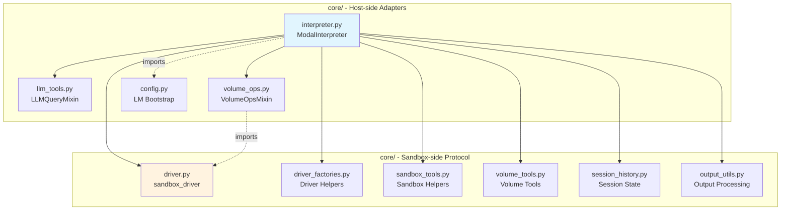
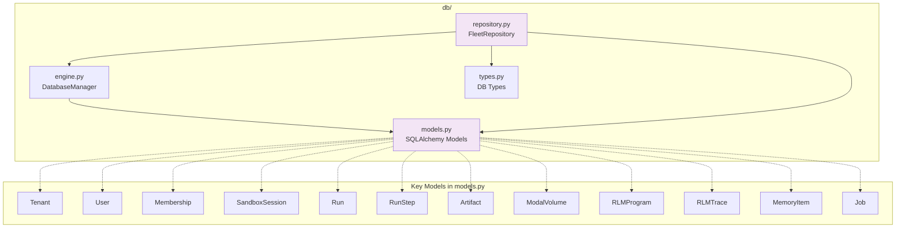
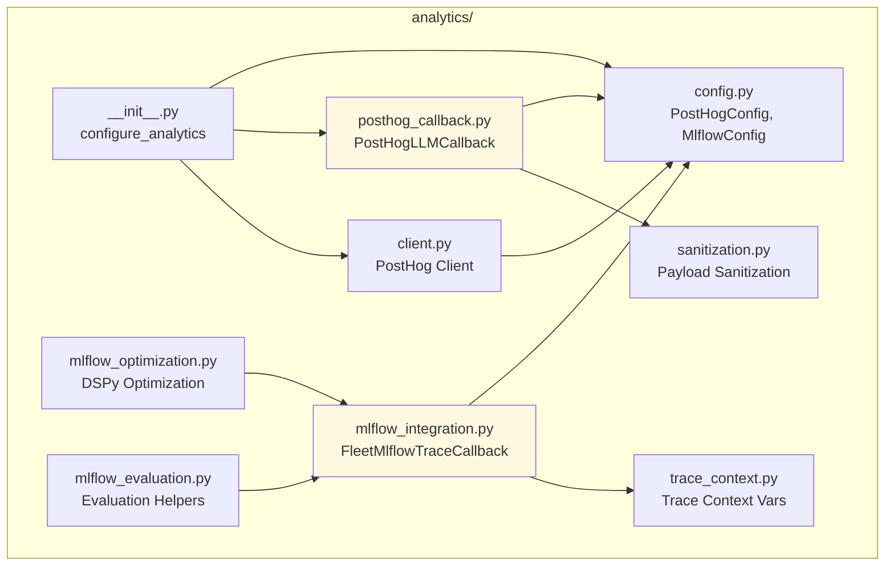
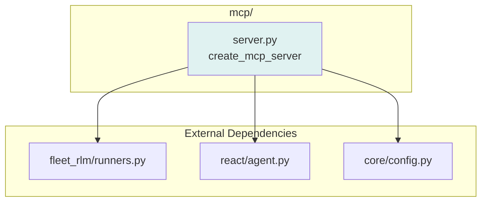
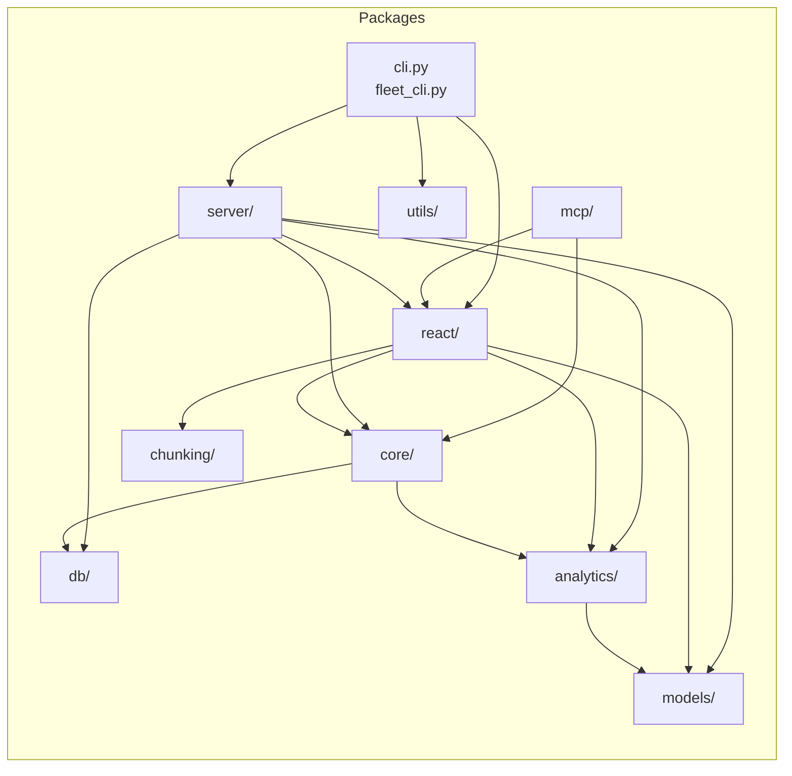

# Python Backend Module Map

This document provides Mermaid diagrams showing the module relationships within `src/fleet_rlm/`. It visualizes import dependencies between the core packages: `core/`, `react/`, `server/`, `db/`, `analytics/`, and `mcp/`.

## Overview

The Fleet-RLM backend is organized into distinct layers:

- **Entry Points**: CLI launchers (`cli.py`, `fleet_cli.py`) and MCP server
- **Server Layer**: FastAPI application, routers, auth, and WebSocket handlers
- **Agent Layer**: ReAct agent orchestration, tools, and streaming
- **Execution Layer**: Modal sandbox interpreter and driver
- **Persistence Layer**: Database models, engine, and repository
- **Analytics Layer**: PostHog and MLflow integration

```mermaid
graph TB
    subgraph "Entry Points"
        CLI[fleet_rlm/cli.py]
        FLEET[fleet_rlm/fleet_cli.py]
        MCP[mcp/server.py]
    end

    subgraph "Server Layer"
        MAIN[server/main.py]
        CONFIG[server/config.py]
        DEPS[server/deps.py]
        ROUTERS[server/routers/]
        AUTH[server/auth/]
        SCHEMAS[server/schemas/]
        EXEC[server/execution/]
    end

    subgraph "Agent Layer"
        AGENT[react/agent.py]
        STREAMING[react/streaming.py]
        COMMANDS[react/commands.py]
        SIGNATURES[react/signatures.py]
        TOOLS[react/tools/]
        DELEGATE[react/delegate_sub_agent.py]
        STREAM_CTX[react/streaming_context.py]
    end

    subgraph "Execution Layer"
        INTERPRETER[core/interpreter.py]
        DRIVER[core/driver.py]
        CORE_CONFIG[core/config.py]
        LLM_TOOLS[core/llm_tools.py]
        SANDBOX_TOOLS[core/sandbox_tools.py]
        VOLUME_OPS[core/volume_ops.py]
        VOLUME_TOOLS[core/volume_tools.py]
    end

    subgraph "Persistence Layer"
        ENGINE[db/engine.py]
        MODELS[db/models.py]
        REPO[db/repository.py]
        TYPES[db/types.py]
    end

    subgraph "Analytics Layer"
        POSTHOG[analytics/posthog_callback.py]
        MLFLOW[analytics/mlflow_integration.py]
        ANALYTICS_CONFIG[analytics/config.py]
    end

    CLI --> MAIN
    CLI --> RUNNERS
    FLEET --> TERMINAL
    FLEET --> MAIN
    MCP --> RUNNERS
    MCP --> AGENT

    MAIN --> CONFIG
    MAIN --> DEPS
    MAIN --> AUTH
    MAIN --> ROUTERS
    MAIN --> REPO
    MAIN --> ENGINE
    MAIN --> ANALYTICS_CONFIG
    MAIN --> CORE_CONFIG

    ROUTERS --> AGENT
    ROUTERS --> STREAMING
    ROUTERS --> REPO
    ROUTERS --> MODELS
    ROUTERS --> MLFLOW
    ROUTERS --> AUTH

    AGENT --> INTERPRETER
    AGENT --> STREAMING
    AGENT --> TOOLS
    AGENT --> DELEGATE
    AGENT --> SIGNATURES
    AGENT --> STREAM_CTX

    TOOLS --> INTERPRETER
    TOOLS --> CHUNKING

    INTERPRETER --> DRIVER
    INTERPRETER --> LLM_TOOLS
    INTERPRETER --> SANDBOX_TOOLS
    INTERPRETER --> VOLUME_OPS
    INTERPRETER --> VOLUME_TOOLS
    INTERPRETER --> CORE_CONFIG

    STREAMING --> STREAM_CTX
    STREAMING --> MLFLOW
    STREAMING --> MODELS

    REPO --> ENGINE
    REPO --> MODELS
    REPO --> TYPES
```



## Core Module (`core/`)

The `core/` package provides the host-side bridge to Modal sandboxes. It contains two logical groups:

1. **Host-side Adapters**: Files that run on the host and manage the interpreter lifecycle
2. **Sandbox-side Protocol**: Files that define the driver protocol and sandbox tools



### Key Dependencies

| From | To | Purpose |
|------|-----|---------|
| `interpreter.py` | `driver.py` | Sandbox process communication |
| `interpreter.py` | `volume_ops.py` | Volume persistence operations |
| `interpreter.py` | `llm_tools.py` | LLM query tools (llm_query) |
| `interpreter.py` | `sandbox_tools.py` | Sandbox-side helper tools |
| `interpreter.py` | `config.py` | Planner/delegate LM resolution |

## React Module (`react/`)

The `react/` package implements the top-level agent runtime using DSPy's ReAct pattern. It orchestrates tool selection, streaming, and sub-agent delegation.

```mermaid
graph TB
    subgraph "react/ - Agent Core"
        AGENT[agent.py<br/>RLMReActChatAgent]
        SIGNATURES[signatures.py<br/>DSPy Signatures]
        VALIDATION[validation.py<br/>Response Validation]
        TRAJECTORY[trajectory_errors.py<br/>Error Tracking]
    end

    subgraph "react/ - Streaming"
        STREAMING[streaming.py<br/>Stream Iterators]
        STREAM_CTX[streaming_context.py<br/>StreamingContext]
        STREAM_CITE[streaming_citations.py<br/>Citation Helpers]
    end

    subgraph "react/ - Delegation"
        DELEGATE[delegate_sub_agent.py<br/>spawn_delegate_sub_agent]
        TOOL_DELEGATE[tool_delegation.py<br/>Dynamic Dispatch]
        RT_MODULES[rlm_runtime_modules.py<br/>Module Registry]
        RT_FACTORY[runtime_factory.py<br/>Factory]
    end

    subgraph "react/ - Support"
        COMMANDS[commands.py<br/>Slash Commands]
        DOC_SOURCES[document_sources.py<br/>Document Loading]
        DOC_CACHE[document_cache.py<br/>Document Cache]
        CORE_MEM[core_memory.py<br/>Core Memory Blocks]
    end

    subgraph "react/tools/"
        TOOLS_INIT[__init__.py<br/>build_tool_list]
        DOC_TOOL[document.py<br/>Document Tools]
        FS_TOOL[filesystem.py<br/>Filesystem Tools]
        SANDBOX_TOOL[sandbox.py<br/>Sandbox Tools]
        DELEGATE_TOOL[delegate.py<br/>Delegation Tools]
        MEMORY_TOOL[memory_intelligence.py<br/>Memory Tools]
        CHUNK_TOOL[chunking.py<br/>Chunking Tools]
    end

    AGENT --> STREAMING
    AGENT --> TOOLS_INIT
    AGENT --> DELEGATE
    AGENT --> SIGNATURES
    AGENT --> STREAM_CTX
    AGENT --> VALIDATION
    AGENT --> CORE_MEM
    AGENT --> DOC_CACHE

    STREAMING --> STREAM_CTX
    STREAMING --> STREAM_CITE

    DELEGATE --> RT_MODULES
    DELEGATE --> RT_FACTORY

    TOOLS_INIT --> DOC_TOOL
    TOOLS_INIT --> FS_TOOL
    TOOLS_INIT --> SANDBOX_TOOL
    TOOLS_INIT --> DELEGATE_TOOL
    TOOLS_INIT --> MEMORY_TOOL
    TOOLS_INIT --> CHUNK_TOOL

    style AGENT fill:#e8f5e9
    style STREAMING fill:#e8f5e9
    style TOOLS_INIT fill:#e8f5e9
```



### Key Dependencies

| From | To | Purpose |
|------|-----|---------|
| `agent.py` | `core/interpreter.py` | Sandbox execution |
| `agent.py` | `streaming.py` | Turn streaming |
| `agent.py` | `tools/` | Tool list assembly |
| `agent.py` | `delegate_sub_agent.py` | Child RLM spawning |
| `streaming.py` | `streaming_context.py` | Context management |
| `tools/` | `chunking/` | Text chunking utilities |

## Server Module (`server/`)

The `server/` package owns the FastAPI application, authentication, routing, and WebSocket runtime. It wires together the persistence, analytics, and agent layers.

```mermaid
graph TB
    subgraph "server/ - Application"
        MAIN[main.py<br/>create_app]
        CONFIG[config.py<br/>ServerRuntimeConfig]
        DEPS[deps.py<br/>ServerState]
        MIDDLEWARE[middleware.py]
        RUNTIME_SETTINGS[runtime_settings.py]
    end

    subgraph "server/auth/"
        AUTH_INIT[__init__.py<br/>build_auth_provider]
        AUTH_DEV[dev.py<br/>Dev Auth]
        AUTH_ENTRA[entra.py<br/>Entra Auth]
        ADMISSION[admission.py<br/>Tenant Admission]
        FACTORY[factory.py]
        BASE[base.py]
        TYPES[types.py]
    end

    subgraph "server/routers/"
        HEALTH[health.py]
        AUTH_ROUTE[auth.py]
        RUNTIME[runtime.py]
        SESSIONS[sessions.py]
        TRACES[traces.py]
    end

    subgraph "server/routers/ws/"
        WS_API[api.py<br/>WebSocket Endpoints]
        WS_RUNTIME[chat_runtime.py<br/>Runtime Bootstrap]
        WS_STREAMING[streaming.py<br/>Event Streaming]
        WS_LIFECYCLE[lifecycle.py<br/>Turn Lifecycle]
        WS_SESSION[session.py<br/>Session State]
        WS_COMMANDS[commands.py<br/>Command Routing]
        WS_MESSAGE[message_loop.py<br/>Message Loop]
        WS_CONN[chat_connection.py<br/>Connection Handler]
        WS_STORE[session_store.py<br/>Session Persistence]
        WS_HELPERS[helpers.py]
        WS_TURN[turn.py]
        WS_REPL[repl_hook.py]
    end

    subgraph "server/schemas/"
        SCHEMA_BASE[base.py]
        SCHEMA_CORE[core.py]
        SCHEMA_SESSION[session.py]
        SCHEMA_TASK[task.py]
    end

    subgraph "server/execution/"
        EXEC_EVENTS[events.py<br/>ExecutionEventEmitter]
        STEP_BUILDER[step_builder.py]
        SANITIZER[sanitizer.py]
    end

    MAIN --> CONFIG
    MAIN --> DEPS
    MAIN --> AUTH_INIT
    MAIN --> HEALTH
    MAIN --> AUTH_ROUTE
    MAIN --> RUNTIME
    MAIN --> SESSIONS
    MAIN --> TRACES
    MAIN --> WS_API
    MAIN --> EXEC_EVENTS

    AUTH_INIT --> AUTH_DEV
    AUTH_INIT --> AUTH_ENTRA
    AUTH_ENTRA --> ADMISSION

    WS_API --> WS_RUNTIME
    WS_API --> WS_STREAMING
    WS_API --> WS_LIFECYCLE
    WS_API --> WS_SESSION
    WS_API --> WS_COMMANDS
    WS_API --> WS_MESSAGE
    WS_API --> WS_CONN

    WS_RUNTIME --> WS_HELPERS
    WS_STREAMING --> EXEC_EVENTS
    WS_LIFECYCLE --> WS_STORE
    WS_SESSION --> WS_STORE

    RUNTIME --> RUNTIME_SETTINGS
    RUNTIME --> SCHEMA_CORE

    style MAIN fill:#fce4ec
    style WS_API fill:#fce4ec
    style AUTH_INIT fill:#fce4ec
```



### Key Dependencies

| From | To | Purpose |
|------|-----|---------|
| `main.py` | `db/` | Database manager and repository |
| `main.py` | `analytics/` | PostHog/MLflow initialization |
| `main.py` | `core/config.py` | LM configuration |
| `routers/ws/*` | `react/` | Agent execution and streaming |
| `routers/ws/*` | `db/` | Session/run persistence |
| `routers/ws/*` | `analytics/` | Trace context and telemetry |
| `auth/` | `db/` | Tenant/user management |

## Database Module (`db/`)

The `db/` package provides typed persistence using SQLAlchemy with Neon/Postgres. It implements row-level security (RLS) for tenant isolation.



### Key Dependencies

| From | To | Purpose |
|------|-----|---------|
| `repository.py` | `engine.py` | Database connection |
| `repository.py` | `models.py` | Model classes for queries |
| `server/main.py` | `db/` | Application database setup |
| `server/routers/ws/*` | `db/` | Session/run persistence |

## Analytics Module (`analytics/`)

The `analytics/` package provides telemetry integration with PostHog and MLflow for LLM call tracking and evaluation.



### Key Dependencies

| From | To | Purpose |
|------|-----|---------|
| `posthog_callback.py` | `dspy.settings.callbacks` | DSPy LLM telemetry |
| `mlflow_integration.py` | `dspy` | Trace capture for evaluation |
| `server/main.py` | `analytics/` | Analytics initialization |
| `server/routers/ws/streaming.py` | `analytics/` | Trace context per request |

## MCP Module (`mcp/`)

The `mcp/` package exposes the runtime as an MCP (Model Context Protocol) tool server. It is intentionally thin, delegating to shared runners and the agent builder.



### Key Dependencies

| From | To | Purpose |
|------|-----|---------|
| `mcp/server.py` | `runners.py` | Shared runtime assembly |
| `mcp/server.py` | `react/agent.py` | Agent construction |
| `mcp/server.py` | `core/config.py` | LM configuration |

## Cross-Module Import Summary

The following diagram shows the primary import relationships between the main packages:



## Verification

The module structure in this document was verified against the actual source tree:

```bash
# Verified module listings
ls src/fleet_rlm/core/      # interpreter.py, driver.py, llm_tools.py, volume_ops.py, sandbox_tools.py, volume_tools.py
ls src/fleet_rlm/react/     # agent.py, signatures.py, streaming.py, streaming_context.py, delegate_sub_agent.py
ls src/fleet_rlm/server/    # main.py, config.py, deps.py, routers/, auth/, schemas/, execution/
ls src/fleet_rlm/db/        # engine.py, models.py, repository.py, types.py
ls src/fleet_rlm/analytics/ # mlflow_integration.py, posthog_callback.py, config.py, client.py
ls src/fleet_rlm/mcp/       # server.py
```

Import relationships were extracted using:

```bash
rg -n "^from fleet_rlm\." src/fleet_rlm/
```

---

*Last updated: 2026-03-09*
*Cross-references: [Source Layout](source-layout.md), [Architecture](../architecture.md), [Codebase Map](codebase-map.md)*
