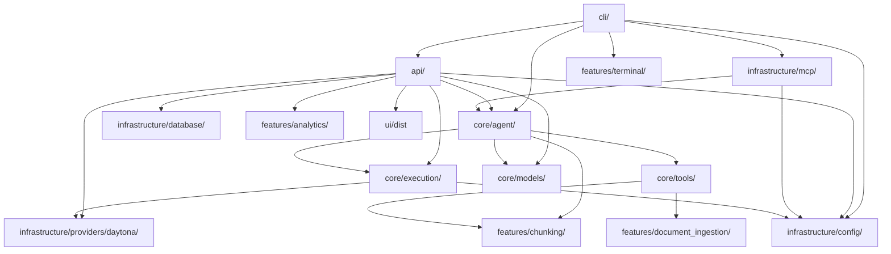
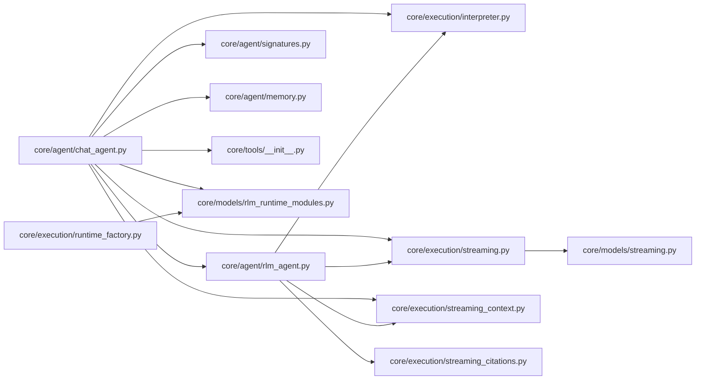
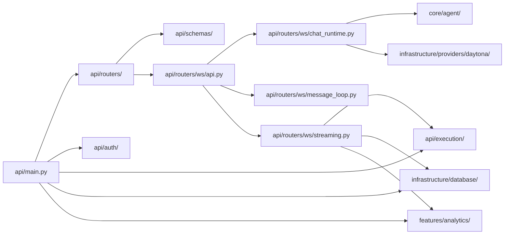

# Python Backend Module Map

This document maps the current module relationships within `src/fleet_rlm/`.
It reflects the post-refactor package split across `api/`, `cli/`, `core/`,
`features/`, and `infrastructure/`.

## Layered Overview



## Runtime Surfaces

| Surface | Entry point | Primary dependencies |
| --- | --- | --- |
| `fleet` | `cli/main.py` | `features/terminal`, `cli/fleet_cli.py` for `fleet web` |
| `fleet-rlm` | `cli/fleet_cli.py` | `cli/commands/*`, `cli/runners.py`, config bootstrap |
| FastAPI server | `api/main.py:create_app` | `api/routers/*`, `api/auth/*`, `infrastructure/database`, `features/analytics` |
| FastMCP server | `infrastructure/mcp/server.py:create_mcp_server` | `runners`, `core.agent`, `core.config` |

## Core Runtime Map



### Key dependencies

| From | To | Purpose |
| --- | --- | --- |
| `core/agent/chat_agent.py` | `core/tools/` | Tool list assembly and tool dispatch |
| `core/agent/chat_agent.py` | `core/execution/interpreter.py` | Sandbox-backed execution |
| `core/agent/rlm_agent.py` | `core/execution/*` | Recursive delegation and streamed child turns |
| `core/tools/*` | `features/chunking/*` | Chunking, grounding, and document workflows |
| `core/models/rlm_runtime_modules.py` | `core/agent/signatures.py` | Runtime module registry |

## API and WebSocket Map



### Key dependencies

| From | To | Purpose |
| --- | --- | --- |
| `api/main.py` | `api/bootstrap.py` | Runtime bootstrap lifecycle and service startup |
| `api/bootstrap.py` | `infrastructure/database/` | Database manager and repository setup |
| `api/bootstrap.py` | `features/analytics/` | PostHog and MLflow lifecycle setup |
| `api/routers/ws/*` | `core/agent/` | Shared runtime execution |
| `api/routers/ws/runtime_options.py` | `infrastructure/providers/daytona/` | Daytona-specific request normalization |
| `api/execution/*` | `core/models/streaming.py` | Trace/event shaping |

## Provider, Persistence, and Feature Packages

| Package | Role | Notable files |
| --- | --- | --- |
| `infrastructure/config/` | App/env/runtime settings | `env.py`, `runtime_settings.py`, `_env_utils.py` |
| `infrastructure/database/` | Persistence boundary | `engine.py`, `models.py`, `repository.py`, `types.py` |
| `infrastructure/providers/daytona/` | Experimental Daytona interpreter backend | `agent.py`, `state.py`, `interpreter.py`, `sandbox/`, `volumes.py`, `config.py`, `smoke.py` |
| `features/analytics/` | Telemetry and evaluation | `client.py`, `posthog_callback.py`, `mlflow_runtime.py`, `mlflow_traces.py`, `trace_context.py` |
| `features/terminal/` | Terminal chat UX | `chat.py`, `commands.py`, `settings.py`, `session_actions.py`, `session_view.py`, `ui.py` |
| `features/scaffold/` | Packaged Codex/Claude assets | `skills/`, `agents/`, `hooks/`, `teams/` |

## Compatibility Surfaces

Several top-level modules remain intentionally thin so older imports keep
working while the real implementation lives elsewhere.

| Compatibility path | Canonical implementation |
| --- | --- |
| `fleet_rlm.runners` | `fleet_rlm.cli.runners` |
| `fleet_rlm.scaffold` | `fleet_rlm.utils.scaffold` |
| `fleet_rlm.analytics` | `fleet_rlm.features.analytics` |

## Verification

The package graph above was checked against the live tree with:

```bash
# from repo root
find src/fleet_rlm -maxdepth 2 -type d | sort
rg --files src/fleet_rlm
rg -n "^from fleet_rlm\\.|^import fleet_rlm\\." src/fleet_rlm
```

Last updated: 2026-03-17
