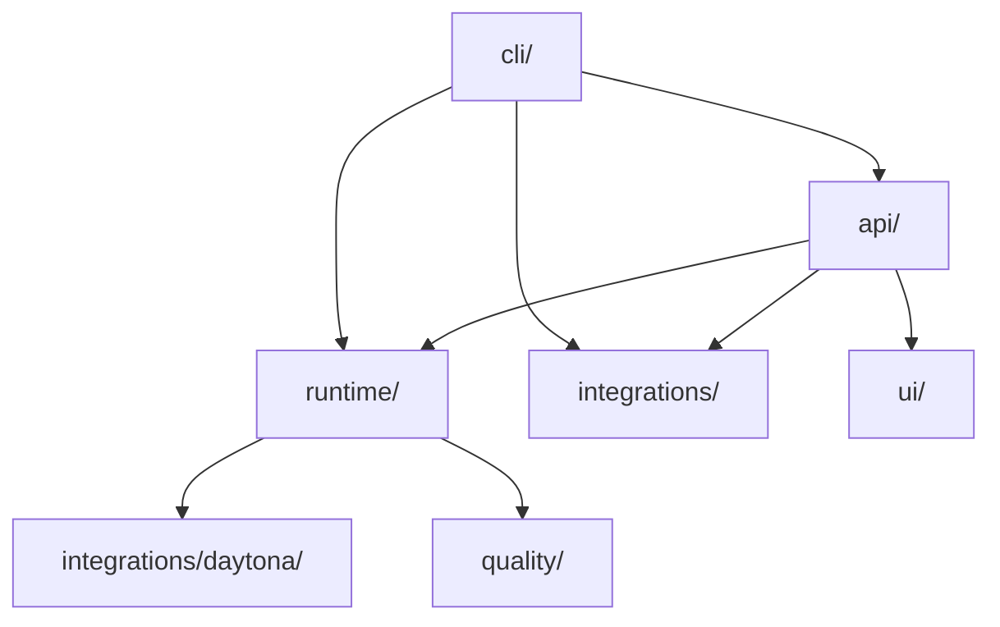
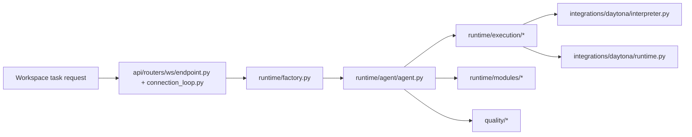
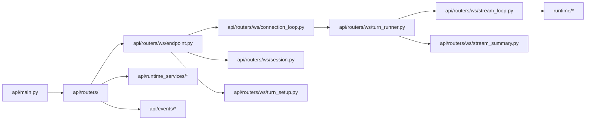

# Python Backend Module Map

This document maps the current module relationships within `src/fleet_rlm/` with the runtime core centered explicitly.

## Layered Overview


```mermaid
graph TB
    CLI["cli/"] --> API["api/"]
    CLI --> RUNTIME["runtime/"]
    CLI --> INTEGRATIONS["integrations/"]

    API --> RUNTIME
    API --> INTEGRATIONS
    API --> UI["ui/"]

    RUNTIME --> DAYTONA["integrations/daytona/"]
    RUNTIME --> QUALITY["quality/"]
```

## Runtime Surfaces

| Surface | Entry point | Primary dependencies |
| --- | --- | --- |
| `fleet` | `cli/main.py` | `cli/fleet_cli.py`, `cli/terminal/*` |
| `fleet-rlm` | `cli/fleet_cli.py` | `cli/commands/*`, `cli/runners.py`, `integrations/config/*` |
| FastAPI server | `api/main.py:create_app` | `api/routers/*`, `api/auth/*`, `api/runtime_services/*`, `integrations/database/*`, `integrations/observability/*` |


## Core Execution Path


```mermaid
graph LR
    REQUEST["Workspace task request"] --> WS["api/routers/ws/endpoint.py + connection_loop.py"]
    WS --> RUNTIME_FACTORY["runtime/factory.py"]
    RUNTIME_FACTORY --> CHAT["runtime/agent/agent.py"]
    CHAT --> EXEC["runtime/execution/*"]
    EXEC --> DAYTONA_INTERPRETER["integrations/daytona/interpreter.py"]
    EXEC --> DAYTONA_RUNTIME["integrations/daytona/runtime.py"]
    CHAT --> MODULES["runtime/modules/*"]
    CHAT --> QUALITY["quality/*"]
```

### Key dependencies

| From | To | Purpose |
| --- | --- | --- |
| `api/routers/ws/endpoint.py`, `connection_loop.py`, `turn_setup.py`, `turn_runner.py`, `stream_loop.py` | `runtime/agent/*` | Authenticate, prepare, run, and stream workspace turns through the shared runtime agent |
| `runtime/agent/agent.py` | `runtime/tools/*` | Tool list assembly and tool dispatch |
| `runtime/agent/agent.py` | `runtime/execution/*` | Streaming turn execution and interpreter support |
| `runtime/agent/runtime.py` | `integrations/daytona/*` | Recursive child execution over the Daytona substrate |
| `runtime/execution/*` | `integrations/daytona/interpreter.py`, `integrations/daytona/sandbox_executor.py`, `integrations/daytona/runtime.py` | Stateful interpreter/session backend integration |
| `runtime/modules/*` | `runtime/agent/*` | DSPy module builders, registry, escalation, workspace phases, and RLM routing |
| `quality/*` | `runtime/agent/*`, `runtime/modules/*` | Offline evaluation and optimization against the live runtime graph |

## API and Host Map


```mermaid
graph LR
    APP["api/main.py"]
    ROUTERS["api/routers/"]
    WS_ENDPOINT["api/routers/ws/endpoint.py"]
    WS_CONNECTION["api/routers/ws/connection_loop.py"]
    WS_SESSION["api/routers/ws/session.py"]
    WS_TURN_SETUP["api/routers/ws/turn_setup.py"]
    WS_TURN_RUNNER["api/routers/ws/turn_runner.py"]
    WS_STREAM_LOOP["api/routers/ws/stream_loop.py"]
    WS_SUMMARY["api/routers/ws/stream_summary.py"]
    RUNTIME_SERVICES["api/runtime_services/*"]
    EVENTS["api/events/*"]
    RUNTIME["runtime/*"]

    APP --> ROUTERS
    ROUTERS --> WS_ENDPOINT
    ROUTERS --> RUNTIME_SERVICES
    ROUTERS --> EVENTS
    WS_ENDPOINT --> WS_CONNECTION
    WS_ENDPOINT --> WS_SESSION
    WS_ENDPOINT --> WS_TURN_SETUP
    WS_CONNECTION --> WS_TURN_RUNNER
    WS_TURN_RUNNER --> WS_STREAM_LOOP
    WS_TURN_RUNNER --> WS_SUMMARY
    WS_STREAM_LOOP --> RUNTIME
```

### Key dependencies

| From | To | Purpose |
| --- | --- | --- |
| `api/main.py` | `api/bootstrap.py` | Runtime bootstrap lifecycle, critical startup, and optional warmup scheduling |
| `api/routers/ws/*` | `api/runtime_services/*` | Runtime orchestration, execution events, and startup/repl bridging |
| `api/runtime_services/settings.py` | `integrations/config/*` | Runtime settings mutation and env/config synchronization |
| `api/runtime_services/diagnostics.py` | `integrations/config/*`, `integrations/daytona/*` | Runtime diagnostics, status, and provider connectivity tests |
| `api/runtime_services/volumes.py` | `integrations/daytona/file_browser.py`, `integrations/daytona/sdk_ops.py` | Volume browsing |
| `api/events/*` | `runtime/execution/streaming_events.py`, frontend workspace stores | Event shaping for passive execution subscriptions and workbench hydration |

## Integration Packages

| Package | Role | Notable files |
| --- | --- | --- |
| `integrations/config/` | App/env/runtime settings | `env.py`, `runtime_settings.py`, `_env_utils.py`, `config.yaml` |
| `integrations/database/` | Persistence boundary | `engine.py`, `fleet_repository.py`, `models_base.py`, `models_enums.py`, `models_identity.py`, `models_jobs.py`, `models_llm_profiles.py`, `models_memory.py`, `models_optimization.py`, `models_runs.py`, `models_sandbox.py`, `repository_chat.py`, `repository_identity.py`, `repository_jobs.py`, `repository_memory.py`, `repository_optimization.py`, `repository_shared.py` |
| `integrations/local_store.py` | Local sidecar persistence | session history, turn transcripts, optimization-run tracking |

| `integrations/observability/` | Telemetry and tracing | `posthog_callback.py`, `mlflow_runtime.py`, `mlflow_traces.py`, `trace_context.py` |
| `integrations/daytona/` | Daytona execution and workspace substrate | `interpreter.py`, `workspace_manager.py`, `sandbox_executor.py`, `isolation.py`, `models.py`, `runtime.py`, `workspace_runtime.py`, `session_runtime.py`, `sdk_ops.py`, `config.py`, `diagnostics.py`, `errors.py`, `bridge.py` |
| `quality/` | DSPy evaluation and optimization | `dspy_evaluation.py`, `optimization_runner.py`, `mlflow_evaluation.py`, `workspace_metrics.py`, `scorers.py` |

## Verification

The package graph above was checked against the live tree with:

```bash
# from repo root
find src/fleet_rlm -maxdepth 2 -type d | sort
rg --files src/fleet_rlm
rg -n "^from fleet_rlm\\.|^import fleet_rlm\\." src/fleet_rlm
```
