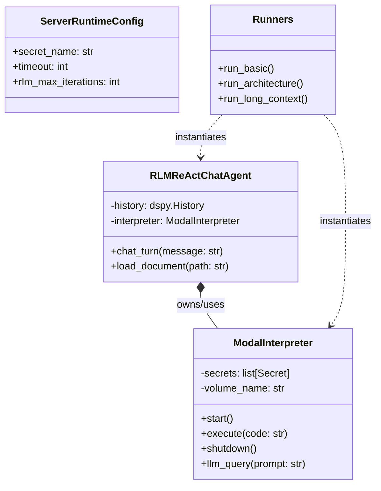

# Python API Reference

This reference documents the core Python classes and functions available in `fleet_rlm` for building custom RLM applications.

## Code Map

The following diagram illustrates the key classes in the `fleet_rlm` library and their relationships.



## Core Modules

### `fleet_rlm.core.interpreter`

#### `class ModalInterpreter`

The main interface for executing code in a Modal sandbox.

**Constructor:**

```python
ModalInterpreter(
    image: modal.Image | None = None,
    timeout: int = 600,
    secret_name: str = "LITELLM",
    volume_name: str | None = None,
    # ...
)
```

**Methods:**

- `start()`: Boots the remote sandbox. Must be called before `execute`.
- `execute(code: str) -> str`: Runs Python code in the sandbox. Returns stdout/stderr or metadata summary.
- `shutdown()`: Terminates the sandbox.
- `__enter__ / __exit__`: Context manager support for automatic startup/shutdown.

### `fleet_rlm.runners`

High-level functions that orchestrate the entire RLM workflow (Config -> Init Interpreter -> Run DSPy -> Cleanup).

#### Functions

- `run_basic(question: str) -> str`: Runs a simple RLM query (e.g., math, fibonacci).
- `run_architecture(docs_path: str, query: str)`: Extracts architecture info from a doc file.
- `run_long_context(document_path: str, query: str)`: Runs the long-context RLM strategy (chunking + subagents).

### `fleet_rlm.signatures`

DSPy Signatures defining the Input/Output schemas for RLM tasks.

#### Signatures

- **`ExtractArchitecture`**:
  - Inputs: `docs`, `query`
  - Outputs: `modules`, `optimizers`, `design_principles`
- **`ExtractAPIEndpoints`**:
  - Inputs: `docs`
  - Outputs: `api_endpoints`
- **`FindErrorPatterns`**:
  - Inputs: `docs`
  - Outputs: `error_categories`, `total_errors_found`
- **`AnalyzeLongDocument`**:
  - Inputs: `document`, `query`
  - Outputs: `findings`, `answer`, `sections_examined`
