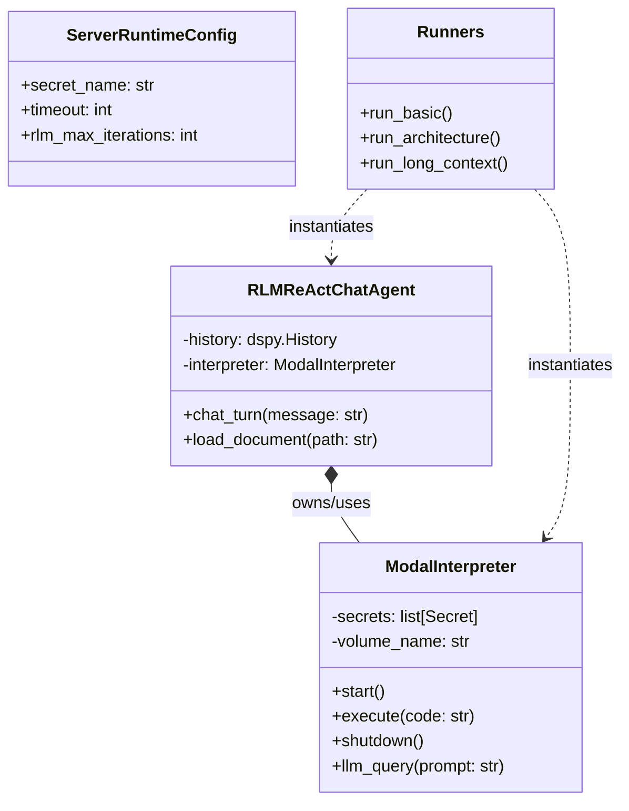

# Python API Reference

This reference documents the core Python classes and functions available in `fleet_rlm` for building custom RLM applications.

## Code Map

The following diagram illustrates the key classes in the `fleet_rlm` library and their relationships.



## Core Modules

### `fleet_rlm.core.interpreter`

#### `class ModalInterpreter`

The main interface for executing code in a Modal sandbox.

**Constructor:**

```python
ModalInterpreter(
    image: modal.Image | None = None,
    timeout: int = 600,
    secret_name: str = "LITELLM",
    volume_name: str | None = None,
    # ...
)
```

**Methods:**

- `start()`: Boots the remote sandbox. Must be called before `execute`.
- `execute(code: str) -> str`: Runs Python code in the sandbox. Returns stdout/stderr or metadata summary.
- `shutdown()`: Terminates the sandbox.
- `__enter__ / __exit__`: Context manager support for automatic startup/shutdown.

### `fleet_rlm.runners`

High-level functions that orchestrate the entire RLM workflow (Config -> Init Interpreter -> Run DSPy -> Cleanup).

#### Functions

- **`build_react_chat_agent(...)`**: Configures and returns an `RLMReActChatAgent` instance.
- **`run_react_chat_once(...)`**: Runs a single turn of the interactive ReAct chat agent.
- **`run_basic(question: str) -> dict`**: Runs a simple RLM query (e.g., math, fibonacci).
- **`run_architecture(docs_path: str, query: str) -> dict`**: Extracts architecture info from a doc file.
- **`run_api_endpoints(docs_path: str) -> dict`**: Extracts API endpoints from documentation.
- **`run_error_patterns(docs_path: str) -> dict`**: Finds and categorizes error patterns.
- **`run_trajectory(docs_path: str, chars: int) -> dict`**: Runs RLM with trajectory tracking for debugging.
- **`run_custom_tool(docs_path: str) -> dict`**: Runs RLM using a custom regex tool for structured extraction.
- **`run_long_context(docs_path: str, query: str, mode: str) -> dict`**: Runs the long-context RLM strategy (chunking + subagents).
- **`check_secret_presence(secret_name: str) -> dict`**: Checks if DSPy env vars are present in a Modal secret.
- **`check_secret_key(secret_name: str, key: str) -> dict`**: Checks if a specific env var key exists in a Modal secret.

### Trajectory Defaults

For `dspy.RLM`-backed runner helpers (`run_basic`, `run_architecture`, `run_api_endpoints`,
`run_error_patterns`, `run_custom_tool`, `run_long_context`), trajectory metadata is included
by default:

- `trajectory_steps`: number of RLM steps
- `trajectory`: raw DSPy trajectory entries
- `final_reasoning`: included when provided by DSPy

Use `include_trajectory=False` to suppress these fields when you need smaller payloads.
`run_trajectory` remains a dedicated compact inspection helper.

### `fleet_rlm.signatures`

DSPy Signatures defining the Input/Output schemas for RLM tasks.

#### Signatures

- **`ExtractArchitecture`**:
  - Inputs: `docs`, `query`
  - Outputs: `modules`, `optimizers`, `design_principles`
- **`ExtractAPIEndpoints`**:
  - Inputs: `docs`
  - Outputs: `api_endpoints`
- **`FindErrorPatterns`**:
  - Inputs: `docs`
  - Outputs: `error_categories`, `total_errors_found`
- **`ExtractWithCustomTool`**:
  - Inputs: `docs`
  - Outputs: `headers`, `code_blocks`, `structure_summary`
- **`AnalyzeLongDocument`**:
  - Inputs: `document`, `query`
  - Outputs: `findings`, `answer`, `sections_examined`
- **`SummarizeLongDocument`**:
  - Inputs: `document`, `focus`
  - Outputs: `summary`, `key_points`, `coverage_pct`
- **`ExtractFromLogs`**:
  - Inputs: `logs`, `query`
  - Outputs: `matches`, `patterns`, `time_range`
