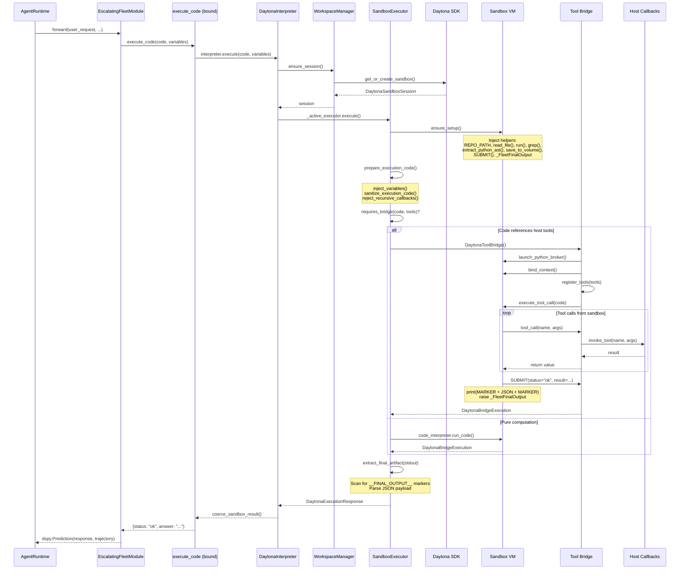

# Sandbox Execution Pipeline

This document describes the full interaction between the host-side `AgentRuntime` and the Daytona sandbox during code execution, including the tool bridge, SUBMIT protocol, recursive delegation, and synchronization points.

## Overview

The execution pipeline transforms a high-level `execute_code()` tool call into isolated sandbox execution with host-side callback support, structured result extraction, and optional recursive delegation.



## Execution Flow

### 1. Tool Binding

When `AgentRuntime` initializes, it binds tools to the interpreter via [`binding.py`](../../src/fleet_rlm/runtime/tools/binding.py):

```python
base_tools = discover_tools()
base_tools = bind_runtime_tools(
    base_tools,
    runtime=self,
    interpreter=interpreter,
)
```

`bind_runtime_tools()` scans the discovered tools and replaces stub implementations with sandbox-aware factories:

- `execute_code()` → calls `interpreter.execute()`
- `sandbox_read_file()` → calls `sandbox.fs.read()`
- `delegate_to_rlm()` → spawns recursive child RLM
- 20+ other sandbox tools

### 2. Session Acquisition

```python
session = self._workspace.ensure_session()
```

`WorkspaceManager.ensure_session()` either reuses an existing sandbox or creates one:

- Check if `_persisted_sandbox_id` exists and sandbox is healthy
- If not, call `DaytonaClient.sandbox.create(spec)` with:
  - Image/snapshot (default: `fleet-rlm-base`)
  - Volume mount at `/home/daytona/memory`
  - Timeout and resource limits
- Store session in `_workspace.session`

### 3. Sandbox Setup

```python
ensure_setup(owner, session, ...)
```

`SandboxExecutor.ensure_setup()` injects Python helper functions into the sandbox:

**Base setup code** (injected once per context):
```python
REPO_PATH = "/home/daytona/workspace"
MEMORY_ROOT = "/home/daytona/memory"

def read_file(path: str) -> str: ...
def run(command: str) -> dict: ...
def grep(text: str, pattern: str) -> list: ...
def extract_python_ast(path: str) -> str: ...

def add_buffer(name: str, item: Any) -> dict: ...
def get_buffer(name: str) -> list: ...
def clear_buffer(name: str) -> dict: ...

def save_to_volume(path: str, content: str) -> str: ...
def load_from_volume(path: str) -> str: ...

def SUBMIT(**kwargs):
    print(f"__FINAL_OUTPUT__{json.dumps(kwargs)}__FINAL_OUTPUT__")
    raise _FleetFinalOutput(kwargs)
```

**Typed SUBMIT signature** (injected when `output_fields` is set):
```python
def SUBMIT(status: str, answer: str, confidence: float):
    # Same as base SUBMIT but with type hints
```

The executor tracks `_setup_context_id` and `_setup_workspace_path` to avoid redundant injections.

### 4. Code Preparation

```python
prepared_code = prepare_execution_code(
    owner,
    code=code,
    variables=variables,
    reject_recursive_callbacks=callbacks.reject_recursive_callbacks,
)
```

**Variable injection**: `inject_variables()` prepends Python literals:
```python
user_request = "What is the capital of France?"
core_memory = "[PERSONA]\nYou are a helpful assistant."
active_skills = {"selected": ["math"], "catalog": {...}}
```

**Sanitization**: `sanitize_execution_code()` strips:
- DSPy sentinel lines (`[[## field ##]]`)
- Markdown fences (` ```python `)
- `Code:` prefixes

**Recursion guard**: `reject_recursive_callbacks()` scans for unsupported callbacks in nested contexts (e.g., `llm_query_batched` inside a child RLM).

### 5. Execution Decision

```python
tools = callbacks.bridge_tools()
if callbacks.requires_bridge(code, tools):
    # Bridge path: host callbacks needed
    bridge = callbacks.ensure_bridge(session, context, tools)
    execution = bridge.execute_tool_call(code, timeout, tool_executor)
else:
    # Direct path: pure computation
    execution = callbacks.execute_direct(session, context, code, envs)
```

`requires_bridge()` checks if the code references any host-side tools:
- `llm_query`, `llm_query_batched`
- `rlm_query`, `rlm_query_batched`
- `delegate_to_rlm`, `delegate_to_rlm_batched`

If yes, the **Tool Bridge** is activated. Otherwise, direct execution is used.

## Tool Bridge Pattern

The Tool Bridge enables bidirectional communication between sandbox code and host-side callbacks.

### Direct Execution

```python
result = session.sandbox.code_interpreter.run_code(
    code,
    context=context,
    on_stdout=_on_stdout,
    on_stderr=_on_stderr,
    envs=envs,
    timeout=timeout,
)
```

Simple execution via Daytona's code interpreter API. No host callbacks, no bridge overhead.

### Bridge Execution

```python
bridge = DaytonaToolBridge(
    sandbox=session.sandbox,
    context=context,
    broker_health_timeout=20.0,
    broker_tool_call_timeout=180.0,
)
bridge.register_tools(tools)
execution = bridge.execute_tool_call(code, timeout, tool_executor)
```

The bridge:

1. **Launches a Python broker process** inside the sandbox (`broker.py`)
2. **Binds the execution context** so the broker can access REPL state
3. **Registers tools** by injecting Python function stubs into the sandbox:
   ```python
   def llm_query(prompt):
       return _bridge_call("llm_query", prompt)
   
   def delegate_to_rlm(query, context=""):
       return _bridge_call("delegate_to_rlm", query, context)
   ```
4. **Executes the code** in the REPL context
5. **Intercepts tool calls**: When sandbox code calls `llm_query("What is 2+2?")`, the stub sends a message to the broker
6. **Dispatches to host**: The broker serializes the call and sends it via IPC (Unix socket) to the host
7. **Host executes**: `invoke_tool(name, args, kwargs)` looks up the tool in `owner._tools` and executes it
8. **Returns result**: The host sends the result back via IPC, the broker injects it into the sandbox, execution continues

### Host-Side Tool Dispatch

```python
def invoke_tool(owner, name, args, kwargs):
    tools = owner._tools
    if name not in tools:
        raise RuntimeError(f"Tool {name!r} is not registered")
    return tools[name](*args, **kwargs)
```

The interpreter's `_tools` dict contains all bound tools. Bridge callbacks are dispatched through this dict.

## SUBMIT Protocol

Sandbox code returns structured results by calling `SUBMIT()`:

```python
# Inside sandbox code
result = compute_something()
SUBMIT(status="ok", answer=result, confidence=0.95)
```

### SUBMIT Implementation

```python
_FINAL_OUTPUT_MARKER = "__FINAL_OUTPUT__"

def SUBMIT(**kwargs):
    print(f"{_FINAL_OUTPUT_MARKER}{json.dumps(kwargs)}{_FINAL_OUTPUT_MARKER}")
    raise _FleetFinalOutput(kwargs)
```

The marker-based protocol:

1. `SUBMIT()` prints JSON wrapped in `__FINAL_OUTPUT__` markers
2. Raises `_FleetFinalOutput` exception to halt execution
3. Host extracts JSON from stdout between markers
4. Returns as `FinalOutput` object to the agent

### Result Extraction

```python
def extract_final_artifact(stdout: str, marker: str = _FINAL_OUTPUT_MARKER):
    start = stdout.find(marker)
    if start == -1:
        return None
    start += len(marker)
    end = stdout.find(marker, start)
    if end == -1:
        return None
    payload = stdout[start:end]
    try:
        parsed = json.loads(payload)
    except json.JSONDecodeError:
        return None
    return {
        "kind": "structured",
        "value": parsed,
        "finalization_mode": "SUBMIT",
    }
```

If `SUBMIT()` was never called, the executor returns raw stdout/stderr text.

### Finalization

```python
def finalize_execution_result(response: DaytonaExecutionResponse):
    if response.final_artifact:
        # SUBMIT was called
        return FinalOutput(response.final_artifact["value"])
    elif response.stderr:
        # Error or warnings
        return f"{response.stdout}\n{response.stderr}"
    else:
        # Plain stdout
        return response.stdout
```

## Recursive Delegation

When the agent calls `delegate_to_rlm()`, the flow becomes recursive.

### Delegation Process

```python
def delegate_to_rlm(query: str, context: str = "", document_url: str = "") -> dict:
    return _delegate_to_rlm(
        query=query,
        context=context,
        document_url=document_url,
        interpreter=interpreter,
    )
```

`rlm_delegate.py` orchestrates:

1. **Build child isolation config**: Determine isolation mode (`auto`, `context`, `fork`)
2. **Create child interpreter**: `build_delegate_child()` spawns a new `DaytonaInterpreter`:
   - Isolated sandbox (or shared with volume subpaths)
   - Propagated recursion depth state (`_sub_rlm_depth + 1`)
   - Bounded LLM budget (`remaining_llm_budget = max_llm_calls - _llm_call_count`)
3. **Execute child turn**: Child runs as a nested `AgentRuntime` turn
4. **Return results**: Child prediction flows back through the tool bridge
5. **Truncate results**: Parent truncates to `delegate_result_truncation_chars` (default: 8000)
6. **Cleanup**: Delete child sandbox (ephemeral)

### Isolation Modes

**`auto` (default)**:
- Parent has mounted volume → Create clean child sandbox with volume subpath (`meta/rlm-children/{uuid}`)
- Parent has no volume → Fork parent sandbox into child
- Fork fails → Retry with clean sandbox (if `RLM_CHILD_FORK_FALLBACK=clean`)

**`context` (debug only)**:
- Reuse parent sandbox with fresh context
- Not recommended for production (breaks isolation)

### Recursion Guard

```python
initialize_llm_query_state(self, sub_lm, max_llm_calls, llm_call_timeout)
initialize_sub_rlm_state(self, max_depth=max_recursion_depth)
```

The interpreter tracks:
- `_sub_rlm_depth`: Current recursion depth (starts at 0)
- `_sub_rlm_max_depth`: Maximum depth (default: 2)
- `_llm_call_count`: Cumulative LLM calls across recursion tree
- `max_llm_calls`: Total budget (default: 50)

When `depth >= max_depth`, `sub_rlm` falls back to `llm_query` (no sandbox execution).

## Synchronization Points

The host and sandbox synchronize at 9 critical points:

### 1. SUBMIT Marker Protocol

**Mechanism**: `__FINAL_OUTPUT__` sentinel markers in stdout

**Contract**: The marker string is a shared constant (`_FINAL_OUTPUT_MARKER` in `_sandbox_constants.py`), used identically by both the injected `SUBMIT()` function (sandbox-side) and `extract_final_artifact()` (host-side).

**Purpose**: Primary structured result channel. Without `SUBMIT`, the host only sees raw stdout/stderr text.

### 2. Tool Bridge IPC

**Mechanism**: In-sandbox Python broker process with Unix socket IPC

**Contract**: Tool registration is bidirectional — `bridge.register_tools(tools)` injects Python function stubs into the sandbox REPL, and `owner._tools` on the host holds the actual implementations. The bridge guarantees FIFO ordering and single-threaded dispatch per execution.

**Purpose**: Bidirectional synchronous RPC channel. The sandbox blocks until the host responds to tool calls.

### 3. Execution Profile Context

**Mechanism**: `context` object passed to `sandbox.code_interpreter.run_code()`

**Contract**: `_setup_context_id` and `_setup_workspace_path` on the host must match `session.context_id` and `session.workspace_path` from the sandbox. Mismatch triggers re-injection of setup code.

**Purpose**: Ensures helper functions and SUBMIT signature are always current before execution.

### 4. Recursion Depth State

**Mechanism**: `_sub_rlm_depth` / `_sub_rlm_max_depth` attributes on the interpreter

**Contract**: `_propagate_parent_recursion_state()` copies depth state from parent to child interpreter at spawn time. The child cannot modify the parent's depth counter.

**Purpose**: Prevents infinite recursion while preserving the delegation pattern.

### 5. LLM Call Budget Sharing

**Mechanism**: `_llm_call_count` counter with `max_llm_calls` ceiling

**Contract**: `initialize_llm_query_state()` sets the ceiling at interpreter construction. `remaining_llm_budget` is computed at delegation time and baked into the child's state. Budget exhaustion raises an error rather than silently degrading.

**Purpose**: Tracks cumulative LLM calls across the entire recursion tree.

### 6. Execution Event Callbacks

**Mechanism**: `execution_event_callback` propagated through three layers

**Contract**: The callback reference is set via a property setter (`interpreter.py:301-311`) that propagates to both the session and executor simultaneously. The callback is always non-blocking — events are queued and drained asynchronously by the streaming layer.

**Purpose**: Every code execution emits `execution_started` and `execution_completed` events for observability.

### 7. Session/Context Identity Tracking

**Mechanism**: `_persisted_sandbox_id`, `_setup_context_id`, `_bridge_sandbox_id` / `_bridge_context_id`

**Contract**: These IDs are compared on every execution. The host never assumes the sandbox state is current — it always checks before proceeding.

**Purpose**: Detects when the sandbox has changed and invalidates cached state (setup code, bridge).

### 8. Variable Injection and Sanitization

**Mechanism**: `inject_variables()` prepends Python literal assignments; `sanitize_execution_code()` strips adapter framing

**Contract**: The `literal()` function (`sandbox_executor.py:1165-1194`) handles all JSON-serializable Python types. `SandboxSerializable` models from `runtime/sandbox_types.py` are the canonical types that cross the boundary.

**Purpose**: Serializes `dspy.RLM` variables as Python literals and sanitizes LLM-emitted code.

### 9. Broker Failure Cooldown

**Mechanism**: Module-level `_BROKER_START_FAILURES` dict with 5-minute cooldown

**Contract**: The cooldown is shared across all executors for the same sandbox ID. `soft_reset()` (pool reuse) clears the cached error, allowing a fresh broker attempt on the next turn.

**Purpose**: When the tool broker fails to start, subsequent executions for that sandbox immediately raise `CodeInterpreterError` without retrying, and stub functions are injected so the REPL agent gets informative errors.

## Error Handling and Degradation

### Graceful Fallback Chain

1. **RLM execution fails** → Falls back to `ChainOfThought` with degradation markers
2. **Tool bridge fails** → Injects stub functions that raise informative errors
3. **Broker startup fails** → Cached failure with 5-minute cooldown
4. **Sandbox timeout** → Returns partial stdout/stderr with error message

### Degradation Tracking

```python
interpreter.mark_runtime_degradation(
    category="rlm_fallback",
    phase="escalating_rlm",
    fallback_used=True,
)
```

Degraded turns are marked in the final prediction with:
- `degraded=True`
- `warning="RLM escalation failed; returned a lightweight fallback response."`
- `runtime_failure_category="rlm_fallback"`
- `runtime_failure_phase="escalating_rlm"`

These markers propagate through the streaming layer and appear in the WebSocket `DONE` event payload.

## Session Lifecycle Management

`WorkspaceManager` handles:

- **Sandbox creation** via Daytona SDK
- **Git clone/checkout** for `repo_url`
- **Volume mounting** at `/home/daytona/memory/`
- **Context staging** (files, manifests)
- **Idle lifecycle timers**:
  - `auto_stop_interval=30` minutes
  - `auto_archive_interval=60` minutes
- **Session state export/import** for persistence

### Session Reuse

```python
session = self._workspace.ensure_session()
```

- Reuses existing sandbox if healthy
- Recreates on workspace reconfiguration (`repo_url`, `volume_name` changes)
- Preserves broker process across pool resets (`soft_reset()`)

## Execution Event Streaming

Throughout execution, events flow to the WebSocket layer:

```python
emit_execution_event(
    self,
    start_event_data(
        execution_profile=str(profile_value),
        code_hash=code_hash,
        code_preview=code_preview,
    ),
)
```

Events include:
- `execution_started`: Code execution begins
- `execution_step`: Tool calls, intermediate outputs
- `execution_completed`: Final result or error
- `trajectory_step`: RLM reasoning steps
- `tool_call` / `tool_result`: Tool invocations

These events are captured by `TurnProgressRelay` and streamed to the frontend via `runtime_streaming.py`.

## Related Documents

- [Agent Runtime Execution Flow](../explanation/agent-runtime-execution-flow.md) — cognition module routing and streaming
- [Architecture Overview](../architecture.md) — high-level layering and design principles
- [DSPy Daytona Interpreter Boundary](dspy-daytona-interpreter-boundary.md) — async execution model and RLM budget knobs
- [Daytona Architecture](daytona-architecture.md) — sandbox lifecycle, volumes, and session continuity
