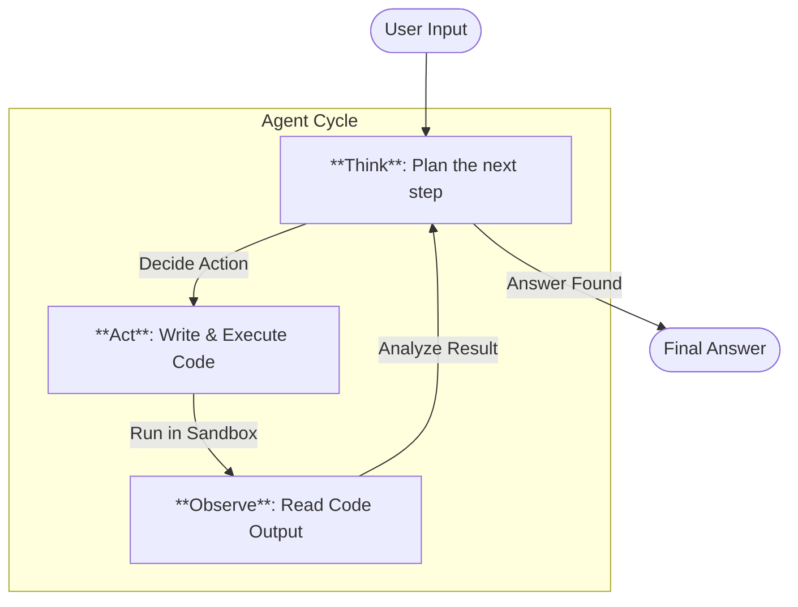

# Interactive Code Chat

This tutorial guides you through the interactive "Code Chat" mode, a Research-Action (ReAct) loop where the agent writes code to answer your questions.

## Overview

The Interactive Chat (`code-chat`) provides a Terminal User Interface (TUI) optimized for monitoring the agent's thought process. Unlike a standard chatbot, this interface separates the conversation from the code execution and internal reasoning.

## Starting the Chat

Run the following command to launch the TUI:

```bash
uv run fleet-rlm code-chat
```

Optional arguments:

- `--legacy`: Use the simple command-line interface instead of the TUI.
- `--model <name>`: Override the default LLM (e.g., `openai/gpt-4o`).

## The User Interface

The TUI is divided into panels to help you track the agent's complex behavior without cluttering the conversation.

```text
+-----------------------------------------------------------+
|  Chat History                                             |
|                                                           |
|  [User]: Calculate the 20th Fibonacci number.             |
|  [Agent]: I will write a recursive function to calculate  |
|           it using the sandbox.                           |
|  [Agent]: The result is 6765.                             |
|                                                           |
+---------------------------+-------------------------------+
|  Tool Outputs             |  Reasoning / Thought Process  |
|                           |                               |
|  > Executing code...      | * Thought: Need to define     |
|  > Code returned: 6765    |   fib() function.             |
|                           | * Action: execute_code        |
|                           | * Observation: Success        |
+---------------------------+-------------------------------+
|  > Input: _                                               |
+-----------------------------------------------------------+
```

## The Workflow

The agent follows a ReAct (Reason + Act) loop.



1.  **Think**: The agent analyzes your request and plans. You see this in the "Reasoning" pane.
2.  **Act**: The agent writes Python code. This is executed in the cloud **Modal Sandbox**.
3.  **Observe**: The agent reads the standard output (`stdout`) or return value. You see this in the "Tool Outputs" pane.
4.  **Loop**: Steps 1-3 repeat until the agent has the answer.

## Key Commands

Inside the chat, you can use special slash commands:

- `/clear`: Clear the chat history.
- `/files`: List files in the sandbox workspace.
- `/upload <path>`: Upload a local file to the sandbox.
- `/exit`: Quit the session.
