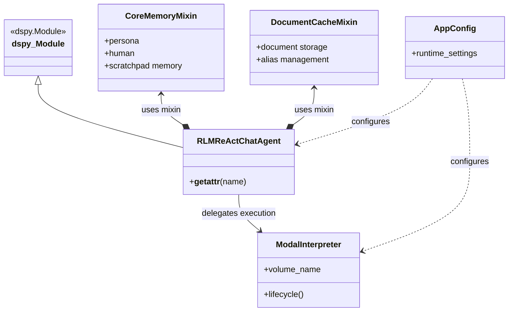

```mermaid
classDiagram
    class dspy_Module {
        <<dspy.Module>>
    }

    class RLMReActChatAgent {
        +__getattr__(name)
    }

    class CoreMemoryMixin {
        +persona
        +human
        +scratchpad memory
    }

    class DocumentCacheMixin {
        +document storage
        +alias management
    }

    class ModalInterpreter {
        +volume_name
        +lifecycle()
    }

    class AppConfig {
        +runtime_settings
    }

    dspy_Module <|-- RLMReActChatAgent
    CoreMemoryMixin <--* RLMReActChatAgent : uses mixin
    DocumentCacheMixin <--* RLMReActChatAgent : uses mixin
    RLMReActChatAgent --> ModalInterpreter : delegates execution
    AppConfig ..> RLMReActChatAgent : configures
    AppConfig ..> ModalInterpreter : configures

    click RLMReActChatAgent call linkCallback("src/fleet_rlm/react/agent.py")
    click CoreMemoryMixin call linkCallback("src/fleet_rlm/react/core_memory.py")
    click DocumentCacheMixin call linkCallback("src/fleet_rlm/react/document_cache.py")
    click ModalInterpreter call linkCallback("src/fleet_rlm/core/interpreter.py")
    click AppConfig call linkCallback("src/fleet_rlm/config.py")
```
