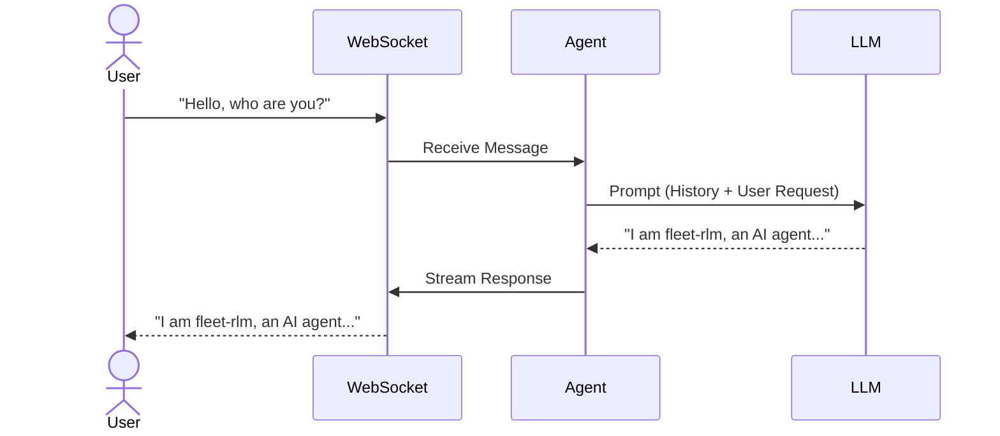
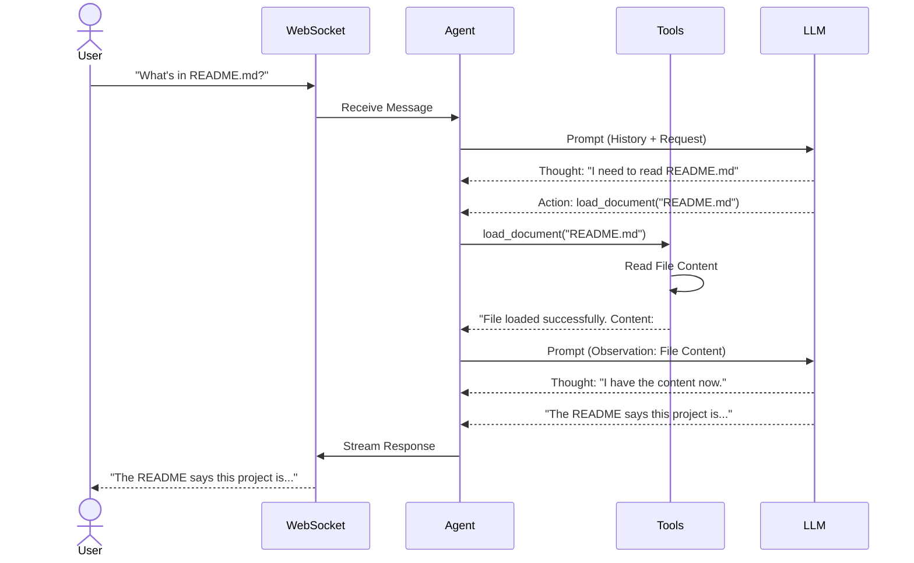
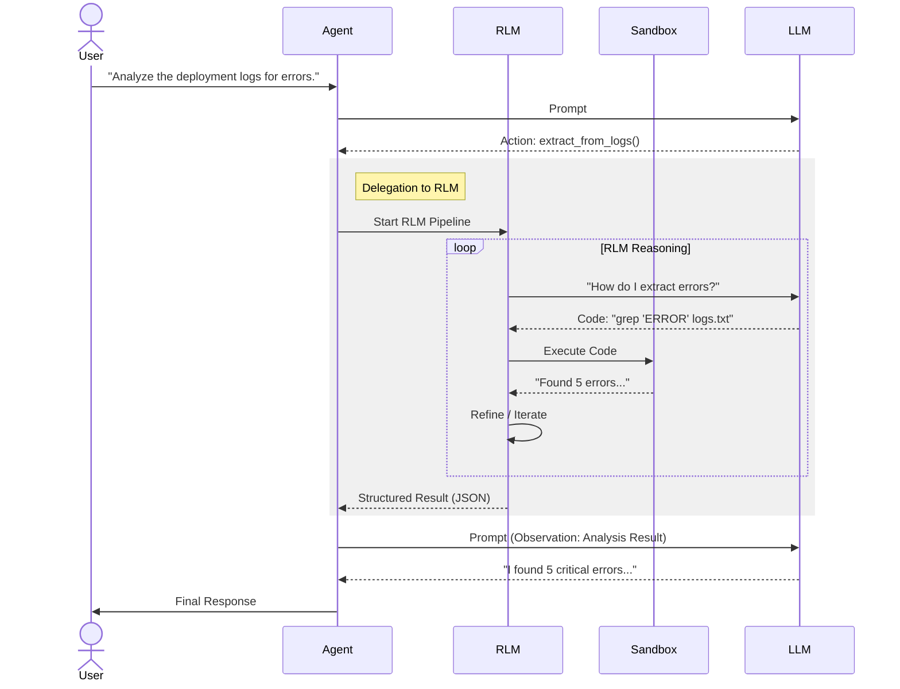
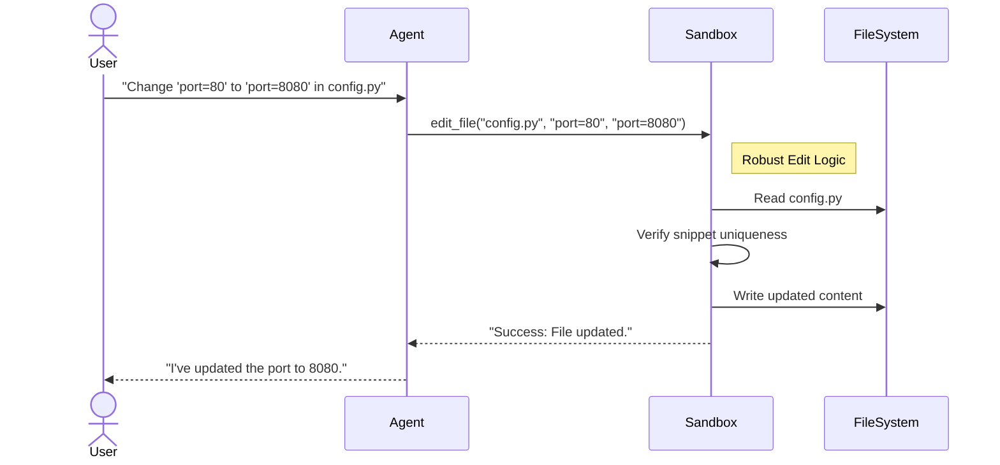

# User Interaction Flows

Visualizing the key sequence of events during user interactions with `fleet-rlm`.

## 1. Standard Chat Turn

Simple question and answer flow without tools.

## 2. Tool-Assisted Chat Turn

User asks for information requiring a tool (e.g., read a file).

## 3. RLM Delegation Flow

User requests complex analysis requiring the Recursive Language Model.

## 4. Sandbox Code Editing

User asks to modify a file, triggering sandbox interaction.

