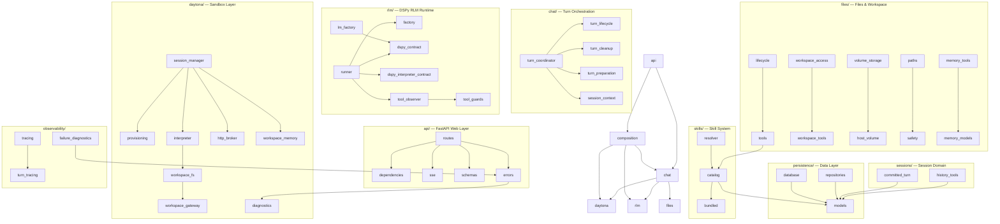

# Fleet RLM Backend System

**Package:** `src/fleet_rlm/`
**Language:** Python 3.11–3.13
**Last verified against commit:** `cfc464c93765e06866279ce998d575d31cefce3a` (`dev-0.7`)

> **Note:** This is a mirror of a Qoder-generated wiki page (`.qoder/repowiki/en/content/FleetRLMBackend.md`),
> corrected and re-grounded against the current codebase. Where the canonical docs
> (`docs/`, `AGENTS.md`, `src/fleet_rlm/AGENTS.md`) disagree, the canonical docs win.

## Overview

Fleet RLM is an RLM-native backend platform that combines FastAPI, DSPy's Recursive
Language Model (RLM), and Daytona sandbox infrastructure to provide isolated, stateful
code execution environments for LLM agents. The system exposes a Session-first,
SSE-streaming HTTP API that drives a monochrome terminal client (pi-tui).

Each Turn (single user request) gets a fresh `dspy.RLM` instance with access to bundled
Skills, Session history, optional Attachments, and — on the Daytona runtime — a cloud
sandbox with a durable Workspace Volume. The RLM recursively generates code, executes it,
observes results, and iterates until producing a final answer.

## Subsystem Architecture



## Core Components

### FastAPI Web Layer (`api/`)

**Purpose:** HTTP translation, SSE streaming, dependency injection, error handling, OpenAPI generation.

**Key modules:**

| Module | Purpose | Key Types |
|--------|---------|-----------|
| `routes/` | Turn/session/attachment/artifact/skill/settings/volume/workspace-file/run endpoints | one `APIRouter` per resource |
| `sse.py` | AI SDK UI v1 stream projection | `_event_to_public_dict`, projector over `RuntimeEvent` |
| `schemas.py` | Pydantic request/response models | `SessionDetailResponse`, `CreateTurnRequest`, `UIMessagePart`, `VolumeTreeResponse` |
| `errors.py` | Closed error responses | `ErrorResponse`, `_STATUS_DEFAULTS`, `install_error_handlers` |
| `dependencies.py` | DI aliases | `TurnCoordinatorDep`, `SessionCatalogDep`, runtime module retrieval |
| `local_scope.py` | Per-request scoping | `LocalScope`, `get_local_scope` |

**Hard boundaries:**

- Routes retrieve runtime modules through dependency aliases; they never construct stores,
  engines, LMs, or provider clients directly.
- `create_app()` installs handlers, routers, and the static in-memory bundled Skill catalog.
  The FastAPI lifespan composition installs and disposes one complete Deno or Daytona
  runtime inventory (`composition/`); private tests install a deterministic composition
  explicitly.
- The supported HTTP surface is `/api/...` only. The legacy top-level chat route, `/api/v1`,
  and WebSocket transports are **removed**.

### Turn Orchestration (`chat/`)

**Purpose:** Turn lifecycle, session context, preparation, cleanup.

**Key classes:**

| Class | Purpose |
|-------|---------|
| `TurnCoordinator` | Public entry (`open`); owns stream orchestration, terminal ordering, heartbeat coordination, final resource cleanup |
| `TurnLifecycleService` | Validation, Artifact publication/adoption, result snapshot, atomic Commit |
| `decide_claim_transition` (`turn_claim.py`) | Pure, side-effect-free Claim transition policy shared by SQL and in-memory Turn stores |
| `DefaultTurnPreparer` (`turn_preparation.py`) | Builds immutable `RLMExecutionContext` + `PreparedTurn` before streaming |
| `TurnCleanupSupervisor` (`turn_cleanup.py`) | Bounded detached cleanup that cannot leak or block callers |

`TurnLifecycle.finish()` owns Artifact Candidate promotion plus atomic Turn Commit, while
`TurnCoordinator` owns stream settlement, terminal ordering, heartbeat coordination, and
cleanup.

### RLM Runtime (`rlm/`)

**Purpose:** DSPy RLM integration, fresh instance construction, event observation.

**Key modules:**

| Module | Purpose |
|--------|---------|
| `runner.py` | RLM execution (`RLMRunner`, `RLMExecutionSpec`) — runs `rlm.acall` on a worker thread |
| `factory.py` / `lm_factory.py` | Fresh `dspy.RLM` construction and `dspy.LM` bundles |
| `dspy_contract.py` / `dspy_interpreter_contract.py` | Pin the DSPy 3.3.0b1 constructor, inject/`FinalOutput` protocol |
| `events.py` | Closed set of typed `RuntimeEvent` / detail dataclasses |
| `tool_observer.py` / `tool_guards.py` | `observe_tool` wrappers; Stagnation/Integrity/workspace guards |
| `sanitize.py` | Redact secrets/private paths from public text |
| `input_models.py` / `inputs.py` | Frozen Pydantic DTOs; serialize bounded payload once before `acall` |

**Design principles:**

- **Fresh RLM per Turn** through `rlm.dspy_contract`; no cross-Turn state leaks.
- **Transport-neutral events**: typed domain objects projected to SSE only in `api/sse.py`.
- Daytona supplies a fresh custom interpreter; Deno passes `interpreter=None` so DSPy
  creates its default Deno/Pyodide interpreter. Only the supported
  `await rlm.acall(**named_inputs)` surface is called.
- Prefer stock `dspy.LM`; never call `litellm` directly from application code.
- DSPy 3.3.0b1 `RLM` uses `max_iterations` (not `max_iters`).

### Daytona Sandbox (`daytona/`)

**Purpose:** Sandbox provisioning, interpreter lease management, workspace filesystem, durable Workspace Memory.

**Key modules:**

| Module | Purpose |
|--------|---------|
| `platform.py` | `AsyncDaytona` client (`build_daytona_client`), `SandboxPlatform`/`VolumeClient` protocol impls |
| `provisioning.py` | Immutable specs (`DaytonaSandboxSpec`, `VolumeConfig`), `SandboxProvisioner`, mount verification |
| `session_manager.py` | Full lease lifecycle: admission (`DaytonaAdmission` bounded semaphore), active-lease registry, acquire/release/replace/quarantine/fencing, idle-stop |
| `interpreter.py` | `DaytonaCodeInterpreter` (tool injection, observation, SUBMIT final-output mediation) |
| `http_broker.py` | In-sandbox HTTP server bridging host tools across process boundaries |
| `workspace_fs.py` | Byte/text I/O over the mounted volume |
| `workspace_gateway.py` | Ephemeral sandboxes for one-off Volume file operations + orphan cleanup |
| `workspace_memory.py` | Durable Workspace Memory records on the Workspace Volume |
| `errors.py` | `DaytonaAdapterError` / `ProviderRequestError`, classification, sanitization |

**Constraints:**

- All Daytona SDK imports are confined to `fleet_rlm/daytona/`.
- Admission bounds concurrent leases to `max_active_daytona_leases` (TOML `defaults.runtime`,
  default 8) via an `asyncio.BoundedSemaphore`.
- Volume identity persists across Sandbox replacement; Session Workspace state survives
  failed Runs.
- Daytona SDK usage references live in the `/daytona` skill, not as DSPy/RLM authority.

### Files & Workspace (`files/`)

**Purpose:** Attachment lifecycle, workspace tools, volume-backed storage, Workspace Memory tools.

**Key modules:**

| Module | Purpose |
|--------|---------|
| `lifecycle.py` | `AttachmentLifecycleService` — upload, SHA-256 integrity, Run-scoped staging |
| `tools.py` | Host tools (`read_attachment`, `create_artifact`, `publish_workspace_artifact`, …) |
| `workspace_tools.py` | Append/update-only workspace tools (list/stat/read/write/append; **no delete**) |
| `workspace_access.py` / `workspace_models.py` | Workspace domain models and Protocols |
| `volume_storage.py` / `volume_paths.py` | `VolumeBlobFs`/`WorkspaceVolumeGateway` contracts, scoped subpath validation |
| `memory_tools.py` / `memory_models.py` | Durable Workspace Memory host tools and records |
| `safety.py` / `workspace_validation.py` | Path validation, filename sanitization, size limits |

**Operations:**

- Attachments are immutable uploads read during Turns via `read_attachment`.
- Session Workspace is append/update-only; there is no delete Tool. Long output should be
  written to the Session Workspace, then `SUBMIT` a short summary.
- Durable Attachments and Artifacts use Workspace Volume Scope.
- Volume backends that reject atomic `os.replace` use a non-atomic overwrite fallback
  (keep new content if only file `fsync` fails).

### Skill System (`skills/`)

**Purpose:** Bundled, immutable skill catalog; progressive on-demand loading; signature validation.

**5 bundled Skills** (under `src/fleet_rlm/skills/bundled/`):

| Name | Signature | Resources | Purpose |
|------|-----------|-----------|---------|
| `dspy-rlm` | None | `rlm-contract.md` | Defines `dspy.RLM` as Recursive LM/REPL (never RAG/`dspy.Retrieve`) |
| `long-context` | None | chunking scripts + strategies | Large document analysis |
| `workspace-files` | None | `filesystem-contract.md` | Workspace tool guidance |
| `data-analysis` | `DataAnalysisSignature` | None | Structured findings/metrics/anomalies |
| `report-builder` | None | None | Create/verify reports |

**Skill selection flow:**

1. Client sends `skill_selections: [{id, expected_version}]` (zero to four exact selections).
2. Resolver validates against the immutable bundled catalog (exact id + version pin).
3. Turn preparation exposes progressive `load_skill` / `read_skill_resource` tools.
4. The model loads instructions/resources on demand; bundled skills never register
   executable tools. Runtime execution uses a typed `RLMExecutionSpec` of host-owned
   `dspy.Tool` objects.

### Persistence (`persistence/`)

**Purpose:** SQLAlchemy models, Alembic migrations, repository adapters.

**Row models / tables** (`persistence/models.py`):

| Model | Table |
|-------|-------|
| `UserRow` | `fleet_users` |
| `WorkspaceRow` | `fleet_workspaces` |
| `SessionRow` | `fleet_sessions` |
| `TurnRow` | `fleet_turns` |
| `RunRow` | `fleet_runs` |
| `SandboxBindingRow` | `fleet_sandbox_bindings` |
| `AttachmentRow` | `fleet_attachments` |
| `ArtifactRow` | `fleet_artifacts` |
| `SkillRow` | `fleet_skills` |

**Repositories** (`persistence/repositories/`): `session_catalog.py`, `turns.py`,
`attachments.py`, `artifacts.py`.

**Migrations & compatibility:**

- Alembic owns live schema evolution through one fresh canonical baseline; run
  `alembic check` against an upgraded empty database for drift.
- `create_tables` is restricted to explicit SQLite test/offline helpers — **never** call it
  from live startup.
- `persistence/database.py` (`ensure_database_compatible`) fails closed on an unreachable
  DB or non-head schema, surfacing only sanitized messages; the supervisor preflight,
  composition startup, and `doctor` share this one helper.
- Postgres (including Databricks Lakebase) engines enable `pool_pre_ping` and a 30-minute
  `pool_recycle` because Lakebase endpoints suspend when idle (scale-to-zero) and enforce
  connection lifetimes; pre-ping + recycle avoid reusing server-closed connections.

### Session Domain (`sessions/`)

**Purpose:** Closed Session domain and the `CommittedTurn` replay model.

- `committed_turn.py` — the `CommittedTurn` aggregate: a tuple of strictly ordered
  `CommittedPart` variants with `__post_init__` invariants; `CommittedTurnCodec` for
  deterministic encode/decode.
- `models.py` — frozen dataclasses (`SessionRecord`, `TurnInput`, `SessionHistory`, …) and a
  versioned codec producing stable idempotency fingerprints.
- `catalog.py` — read-oriented domain values + `SessionCatalog` Protocol.
- `history_tools.py` — the `read_session_history` DSPy tool with a fixed **256 KiB**
  aggregate byte budget (host constant, whole-message omission, `truncated`/`bytes_returned`/
  `byte_budget`/`skipped_ordinal` continuation metadata).
- **Replay source:** `CommittedTurn` is the only replay source. A successful Daytona Run may
  retain one private commit-gated `result.json` derivative; it is not an Artifact or API
  resource, and Deno has no result-snapshot sink.

### Observability (`observability/`)

**Purpose:** Fail-soft engineering observability (never affects Turn outcomes).

| Module | Purpose |
|--------|---------|
| `tracing.py` | MLflow DSPy autolog against Databricks; bridges `DATABRICKS_HOST`/`DATABRICKS_TOKEN`; idempotent |
| `turn_tracing.py` | `turn_trace()` context manager opens a root `fleet_turn` span per live Turn; `annotate_trace_io()` propagates request/response to the root span for MLflow judges; trace id exposed via `ContextVar` |
| `failure_diagnostics.py` | `FailureDiagnostic`, `normalize_turn_failure` — sanitized error classification |

- Databricks MLflow tracing is controlled by the selected TOML profile. When policy enables
  trace exposure, a public `traceId` may appear only as optional `messageMetadata` on existing
  SSE `start`/`finish` chunks — never as a new RuntimeEvent kind or credential-bearing payload.
- Heartbeat-loss failures annotate the active MLflow trace via the same fail-soft helper.

### Composition (`composition/`)

**Purpose:** Wire one Deno or Daytona runtime inventory at startup.

| Module | Function |
|--------|----------|
| `daytona.py` | Full Fleet path (Sandbox, Workspace Volume scope, Artifact promotion, Workspace Memory) |
| `deno.py` | Local vanilla `dspy.RLM` (real LM + DSPy default Deno/Pyodide), Attachment reads and Skills, no durable Artifact promotion |
| `testing.py` | Credential-free deterministic composition for private tests |
| `common.py` | Shared composition helpers |

The canonical public Run Environment set is **`deno` and `daytona`**. There is **no**
compatibility runtime or dual-serve path.

## Configuration

Runtime policy is required from `config/fleet.toml`; `FLEET_CONFIG_PROFILE` selects a
profile, and only environment variables explicitly referenced by that policy supply secrets
or endpoints. Pydantic `BaseSettings` (`config.py`) loads `.env` + process env with the
`FLEET_` prefix as higher-precedence overrides. `config_policy.py` (loopback-only
`/api/settings`) edits only non-secret TOML policy for the next restart.

### Committed profiles (`config/fleet.toml`)

| Profile | `runtime.environment` | Notes |
|---------|----------------------|-------|
| `local-deno` | `deno` | Local Deno development |
| `daytona` | `daytona` | Daytona + Databricks AI Gateway LLM + MLflow tracing |
| `databricks-daytona` | `daytona` | Databricks-hosted; both LLM roles via unified `/ai-gateway/openai/v1` |

### Key environment variables

| Variable | Description |
|----------|-------------|
| `FLEET_CONFIG_PROFILE` | **Required.** TOML profile name (e.g. `local-deno`, `daytona`) |
| `FLEET_RUN_ENVIRONMENT` | Optional override; conflicts with the profile's `runtime.environment` are rejected |
| `FLEET_LLM_API_KEY` | LLM provider key (referenced by `defaults.llm.*.api_key_env`) |
| `FLEET_LLM_BASE_URL` | Optional LLM base endpoint |
| `FLEET_DATABASE_URL` | SQLAlchemy URL; SQLite for local, asyncpg for Postgres/Lakebase |
| `FLEET_DAYTONA_API_KEY` | Daytona provider key (Daytona profile) |
| `FLEET_LOG_LEVEL` | Backend + DSPy log level |
| `DATABRICKS_HOST` / `DATABRICKS_TOKEN` | Databricks MLflow tracking auth (Databricks profiles) |
| `FLEET_LIVE` | Explicit opt-in for live/credentialed test runs |

Secrets live only in `.env`/process env referenced by the TOML policy; `config/fleet.toml`
contains no secret values.

## Key Data Flow

### Turn Execution (Daytona)

```
POST /api/sessions/{session_id}/turns
  Header: Idempotency-Key (required)
  Body:   {text, attachment_ids?, skill_selections?}

→ FastAPI validates session, Idempotency-Key, attachment ownership, skill selections
→ TurnCoordinator.open()
   → TurnLifecycle.begin(): replay committed suffix or atomically claim a Run
→ DefaultTurnPreparer.prepare(): resolve skills, stage attachments, build RLMExecutionContext
→ RLMRunner.stream(context): fresh dspy.RLM + DaytonaCodeInterpreter on a worker thread;
   observe live code/output at the interpreter boundary and host tools via wrapped tools
→ api/sse.py projects typed RuntimeEvents → AI SDK UI v1 SSE chunks
→ TurnLifecycle.finish(): publish/adopt Artifact Candidates, private result snapshot,
   run the atomic Turn Commit
→ TurnCoordinator cleanup: stream settlement, terminal ordering, heartbeat stop, resource cleanup
```

### Turn Execution (Deno)

Same claim/prepare/run flow, but: `DenoRunEnvironment` passes `interpreter=None` (DSPy
default Deno/Pyodide), Attachments are read from the local workspace, and there is no
durable Artifact promotion.

## Design Principles

1. **Fresh RLM per Turn** — new `dspy.RLM` each Turn; no cross-Turn state leaks.
2. **Atomic commit** — `TurnLifecycle.finish()` owns Artifact promotion + `CommittedTurn`
   in one Commit.
3. **Fail-soft observability** — tracing/diagnostics never change Turn outcomes; errors are sanitized.
4. **Progressive skill loading** — skills load on demand (up to 4 selections per Turn).
5. **Transport-neutral events** — only `api/sse.py` projects to SSE.
6. **Closed errors** — HTTP returns `{code, message}` JSON; no stack traces or credentials.
7. **Daytona boundary** — all Daytona SDK imports inside `fleet_rlm/daytona/` only.
8. **Alembic ownership** — live schema evolves via Alembic; `create_tables` for tests only.
9. **BYOK deployment** — Bring-Your-Own-Key; never leak server-level secrets to clients.
10. **Append-only workspace** — append/update only; no delete Tool; `read_session_history`
    bounded to a 256 KiB aggregate budget.

## Error Handling

All API errors return a closed JSON body:

```json
{ "code": "ERROR_CODE", "message": "Human-readable description" }
```

Representative status/code mapping (see `api/errors.py` `_STATUS_DEFAULTS` / `_DETAIL_CODES`):

| Status | Code | Meaning |
|--------|------|---------|
| 400 | `invalid_request` | Malformed request / invalid workspace-tree root |
| 404 | `session_not_found` / `not_found` | Resource missing |
| 409 | `turn_in_progress` | A Turn is already executing for the Session |
| 409 | `idempotency_mismatch` | `Idempotency-Key` reused with a different payload |
| 422 | `invalid_skill_selection` | Skill not found or version mismatch |
| 503 | `turn_unavailable` / `volume_unavailable` | Backend/Workspace Volume not ready |
| 504 | `turn_preparation_timeout` | Turn preparation exceeded its deadline |

Provider/provider-SDK exceptions are normalized through `daytona/errors.py` and never leak
raw `str(exc)`, stack traces, credentials, or provider internals. A `correlation_id` may be
included by the API error envelope for support; the exact shape is defined by `ErrorResponse`.

## Testing

```bash
# Default non-live/non-benchmark lane (parallel, max 2 xdist workers)
make test

# Deno deterministic contracts (pinned Deno runtime, no provider network)
make test-deno

# Canonical coverage lane (package-wide, fail_under = 75)
make test-daytona-cov

# Full repo quality gate
make check
```

Live promotion tests require explicit `FLEET_LIVE=1` and load the repo `.env` via
`python-dotenv` (`override=False`); existing process exports still win. Credentialed
Daytona proof uses `tests/live/backend/` and `scripts/live_daytona_verify.py`.

## Related

- [Fleet Terminal Client](FleetTerminalClient.md) — pi-tui TUI usage
- [Terminal UI how-to](../../how-to-guides/terminal-tui.md) — canonical terminal client doc
- [HTTP API reference](../../reference/http-api.md) — supported routes and SSE behavior
- [Configuration reference](../../reference/configuration.md) — canonical `FLEET_*` settings
- [Database reference](../../reference/database.md) — canonical tables and Alembic ownership
- [Backend Core knowledge module](../knowledge/fleet-rlm-monorepo/backend-core/README.md)
