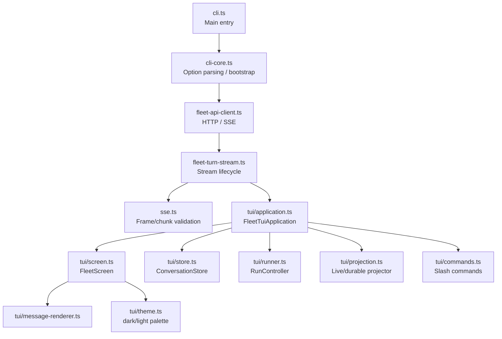

# Fleet TUI Terminal Client

**Location:** `tools/fleet-tui/`
**Runtime:** Node.js `>=22.19.0` (ESM, `tsx`), pnpm — **not** Deno
**Framework:** `@earendil-works/pi-tui@0.82.0`
**Last verified against commit:** `cfc464c93765e06866279ce998d575d31cefce3a` (`dev-0.7`)

> **Note:** Mirror of a Qoder-generated wiki page (`.qoder/repowiki/en/content/FleetTerminalClient.md`),
> corrected against the current codebase. The maintained client is pi-tui only — no web
> frontend, no React, no browser runtime. `tools/fleet-tui/AGENTS.md` is authoritative.

## Overview

The Fleet TUI (Terminal User Interface) is the maintained development client for Fleet RLM.
It's a monochrome, pi-tui-based terminal that consumes the SSE-streaming FastAPI backend and
drives interactive multi-turn conversations with the RLM. It renders reasoning, tool calls,
code, output, artifacts, and results with fully-expanded, native-terminal-scrollback evidence.

## Running the Client

```bash
# Supervised full stack (Daytona backend + pi-tui), attaches TUI to :8000
uv run fleet cli

# Local Deno backend (supervises Deno + pi-tui)
uv run fleet deno

# Backend-only (no TUI)
uv run fleet web
uv run fleet-rlm serve-api --port 8000

# Opt-in disposable Daytona provider/mount probe
uv run fleet doctor daytona
```

The TUI itself is launched from `tools/fleet-tui/` via `pnpm start` (`tsx src/cli.ts`).

## Architecture



### Core Components

- **Entry & CLI (`cli.ts`, `cli-core.ts`)** — argument parsing, artifact-download mode,
  session resolve/resume, durable-turn projection, then hands control to the TUI.
- **API & streaming (`fleet-api-client.ts`, `fleet-turn-stream.ts`, `sse.ts`)** — typed HTTP
  client over generated OpenAPI types (`./generated/openapi.js`); `sse.ts` validates chunk
  shapes against the `FleetUIMessageChunk` union; `streamFleetTurn` enforces stream
  invariants (one `start` → … → one terminal → `[DONE]` last) with one network retry on
  transient failures.
- **TUI application (`src/tui/`)** — state-driven: `ConversationStore` (unidirectional
  dispatch + pure `reduce`; all mutation through `store.dispatch`), a `RunController` that
  drives the SSE stream, a `FleetScreen` on pi-tui's `TUI`/`Editor`, and a slash-command
  registry. Views under `tui/views/` are composed by `application.ts`.

Dependency direction is strictly top-down: `cli.ts` → `application.ts` →
(`store.ts`, `runner.ts`, `screen.ts`, `commands.ts`, `fleet-api-client.ts`).

### Slash Commands (`tui/commands.ts`)

Representative commands (`/sessions`, `/new`, `/resume`, `/rename`, `/skills`, `/skill`,
`/settings`, `/quit`, …). `/settings` reads and edits non-secret `config/fleet.toml` policy
only through the loopback-only settings API; it never displays `.env` values, and saved
changes require a Fleet restart. See `tools/fleet-tui/AGENTS.md` for the authoritative list.

## Key Features

### Real-Time Streaming

- Consumes the AI SDK UI v1 SSE stream from `POST /api/sessions/{session_id}/turns`.
- The wire chunk union is `FleetUIMessageChunk` (from `tools/fleet-tui/src/generated/openapi.ts`),
  with chunk **types** such as: `start`, `start-step`, `finish-step`, `reasoning-start`,
  `reasoning-delta`, `reasoning-end`, `data-status`, `data-skill`, `data-rlm-code`,
  `data-rlm-output`, `tool-input-available`, `tool-output-available`, `tool-output-error`,
  `data-attachment`, `data-warning`, `data-artifact`, `data-usage`, `data-structured-result`,
  `text-start`, `text-delta`, `text-end`, `finish`, `abort`, `error`.
- `[DONE]` is the terminal frame. Live evidence (DSPy callback reasoning, Tools, Daytona
  interpreter code/output) is reconciled against the completed native trajectory after the
  stream settles.

### Evidence Presentation

- **Fully expanded**: all evidence statically expanded (no collapsing state).
- **Native scrollback**: uses the terminal's native scrollback buffer; Fleet does not capture
  the mouse or maintain a transcript viewport.
- **Monochrome** operator palette; generated code is syntax-highlighted (highlight.js).

### Session Management

- List, create, resume, rename, archive Sessions; cursor-paginated Turn history.
- The client generates an `Idempotency-Key` per Turn for safe same-key retry on reconnect.
- Attachments upload and are referenced by id.

### Skill Selection

- Browse the bundled catalog, pin exact versions, validate before submitting a Turn;
  skills load progressively during the Turn.

### Artifact Handling

- Surfaces `data-artifact` events; supports an artifact-download mode from the CLI.

### Error Handling

- API errors use `FleetApiError` with `status`, `correlationId`, `code` (closed `{code, message}`
  JSON from the backend); never exposes stack traces.

## Data Models (internal client types)

These are the TUI's **client-side** shapes; the backend's SSE wire format is the
`FleetUIMessageChunk` union above, and durable committed turns are projected from
`CommittedTurn` parts via `tui/projection.ts`.

- `FleetSession` — Session metadata (id, title, status, timestamps).
- `FleetSkillCard` — bundled skill catalog entry.
- `FleetSettingsPolicy` — the non-secret TOML policy view from `/api/settings`.
- `FleetVolumeTree` — Workspace Volume tree from `GET /api/volume/tree`.

## Integration Points

- **Backend API** — consumes `openapi.yaml` (`/api/sessions`, `/api/sessions/{id}/turns`,
  `/api/attachments`, `/api/artifacts`, `/api/files`, `/api/volume/tree`, `/api/skills`,
  `/api/settings`, `/api/runs/{id}/cancellation`).
- **Generated OpenAPI types** — `tools/fleet-tui/src/generated/openapi.ts` is produced from
  `openapi.yaml` by `make api-sync`; verify drift with `make api-check`. **Do not hand-edit.**
- **Environment** — the backend base URL and run environment come from Fleet's TOML/ENV
  policy; the TUI targets `http://127.0.0.1:8000` in the supervised local loop.

## Testing

```bash
# From the repo root — full TUI lane: api-check + format + lint + typecheck + tests
make tui-check

# Individual lanes from tools/fleet-tui/
pnpm test          # Vitest
pnpm typecheck     # tsc --noEmit
pnpm lint          # biome lint
pnpm format:check  # biome format check
```

Focused tests live beside their source under `src/tests/` or `src/tui/tests/`.

## Known Limitations

- Monochrome, terminal-only; no GUI/web frontend.
- No mouse capture and no transcript viewport (native scrollback only).
- Evidence always fully expanded (no collapsing state).
- Requires an active backend connection (no offline mode).

## Related

- [Fleet RLM Backend](FleetRLMBackend.md) — backend architecture
- [Fleet TUI knowledge module](../knowledge/fleet-rlm-monorepo/fleet-tui/README.md)
- [HTTP API reference](../../reference/http-api.md)
- [Terminal UI how-to](../../how-to-guides/terminal-tui.md)
