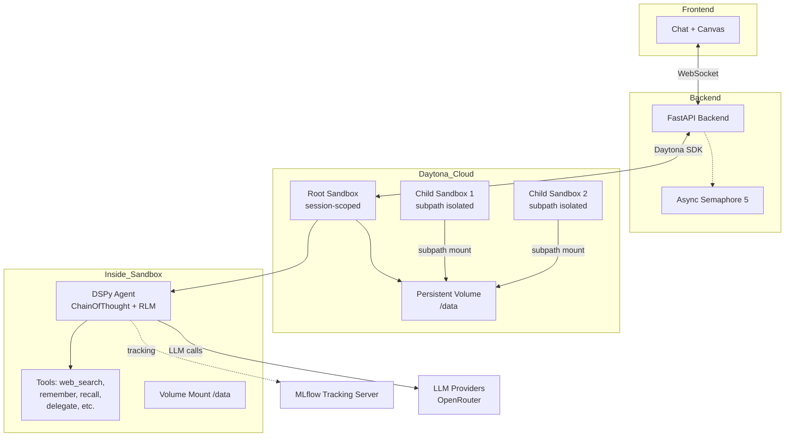
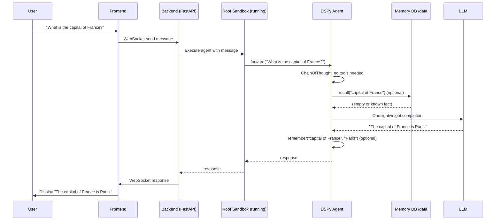
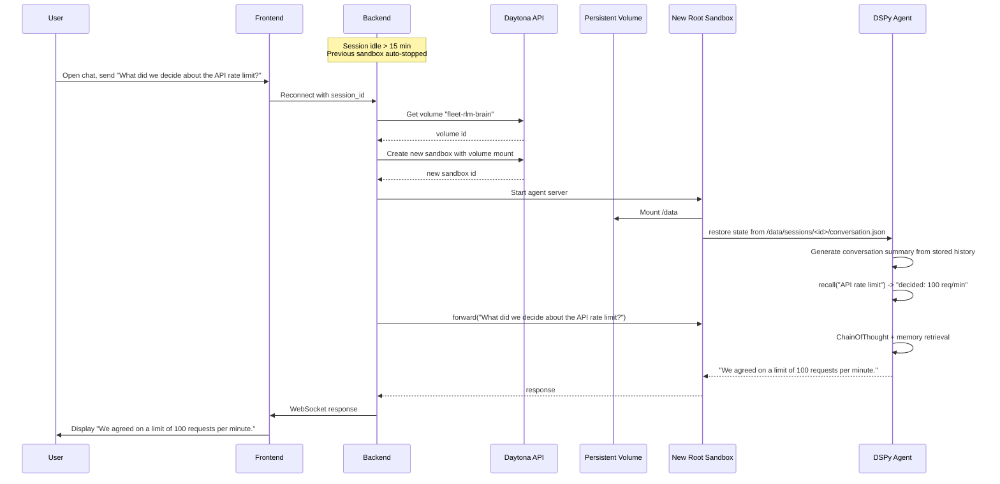
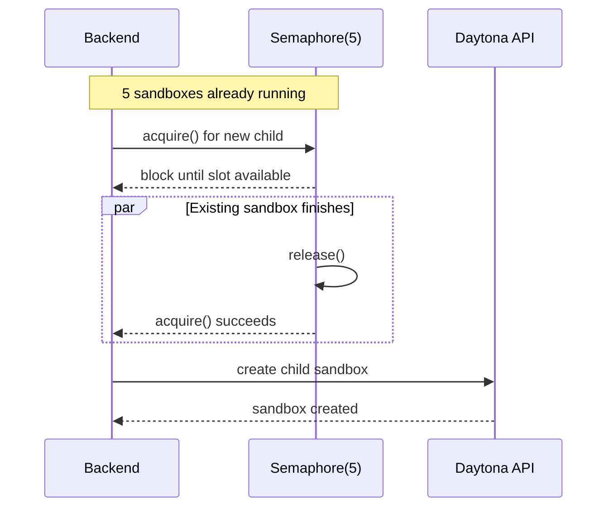

Here are the key interaction diagrams for the planned `fleet‑rlm` system. Use any Mermaid renderer (e.g., GitHub, Mermaid Live) to view them.

---

## 1. High‑Level Architecture



---

## 2. Scenario A: Simple Chat (Warm Sandbox)

User asks a quick question; sandbox already running.



---

## 3. Scenario B: Complex Task with Child Delegation

User asks to investigate TODOs in a codebase; agent escalates to RLM and spawns children.

```mermaid
sequenceDiagram
    participant U as User
    participant FE as Frontend
    participant BE as Backend
    participant RootSB as Root Sandbox
    participant Agent as DSPy Agent (RLM)
    participant Vol as Persistent Volume
    participant ChildSB as Child Sandbox (ephemeral)

    U->>FE: "Find all TODO comments in sklearn and fix the easiest one"
    FE->>BE: WebSocket send
    BE->>RootSB: Execute agent with task
    RootSB->>Agent: forward(task)
    Agent->>Agent: ChainOfThought detects [TOOLS NEEDED]
    Agent->>Agent: RLM loop starts (max_iters=60)

    loop RLM Iterations
        Agent->>Tools: execute("ls sklearn/") etc.
        Agent->>Agent: Decides to delegate
        Agent->>Tools: delegate_to_rlm_batched([
            "TODOs in sklearn/linear_model/",
            "TODOs in sklearn/ensemble/",
            "TODOs in sklearn/tree/"
        ])

        par Parallel child creation
            Tools->>BE: Spawn Child Sandbox (linear_model)
            Tools->>BE: Spawn Child Sandbox (ensemble)
            Tools->>BE: Spawn Child Sandbox (tree)
        end

        BE->>ChildSB: Create sandbox with VolumeMount(subpath=sessions/child1)
        BE->>ChildSB: Create sandbox with VolumeMount(subpath=sessions/child2)
        BE->>ChildSB: Create sandbox with VolumeMount(subpath=sessions/child3)

        ChildSB->>ChildSB: Child RLM runs, searches code
        ChildSB-->>RootSB: Return result ("Found 5 TODOs, easiest is ...")
    end

    Agent->>Tools: edit_file(...) to fix the easiest TODO
    Agent->>Tools: SUBMIT("Patch generated")
    Agent-->>RootSB: Final answer + patch
    RootSB-->>BE: result
    BE->>FE: WebSocket response with patch preview
    FE->>U: Show fixed file diff
```

---

## 4. Scenario C: Session Resumption After Auto‑Stop

User returns after a long break; the previous sandbox has been stopped by Daytona. A new sandbox is created with the same volume, restoring state.



---

## 5. Concurrency Control (Semaphore)

When the 5‑sandbox cap is reached, new sandbox creation is queued.



---

These diagrams capture the core flows of the post‑plan architecture. Would you like any additional scenario or a more detailed component breakdown?