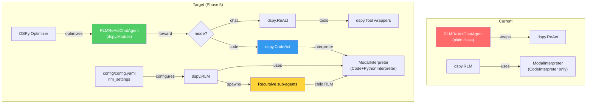

# fleet-rlm Alignment Analysis v2

> Consolidated alignment report after user review. All recommendations confirmed and prioritized.

---

## Baseline Feature Matrix — Current State

| Feature                    | DSPy RLM | Daytona | fleet-rlm  | CodeAct | Gap |
| -------------------------- | -------- | ------- | ---------- | ------- | --- |
| Sandboxed REPL             | ✅       | ✅      | ✅         | ✅      | —   |
| `llm_query()`              | ✅       | ✅      | ✅         | ❌      | —   |
| `llm_query_batched()`      | ✅       | ✅      | ✅         | ❌      | —   |
| `SUBMIT()` convention      | ✅       | ✅      | ✅         | ❌      | —   |
| Custom tools               | ✅       | ❌      | ✅         | ✅      | —   |
| `sub_lm` support           | ✅       | ❌      | ✅         | ❌      | —   |
| `dspy.Module` subclass     | ✅       | N/A     | ✅         | ✅      | —   |
| `dspy.Tool` wrappers       | ✅       | N/A     | ✅         | ❌      | —   |
| Typed Signature outputs    | ✅       | N/A     | ❌         | ✅      | 🔴  |
| Recursive sub-agents       | ❌       | ✅      | ❌         | ❌      | 🔴  |
| `edit_file()` sandbox tool | ❌       | ✅      | ✅         | ❌      | —   |
| Trajectory surfacing       | ✅       | ❌      | ✅         | ✅      | —   |
| `max_output_chars` (10K)   | ✅       | ✅      | ⚠️ 500     | ❌      | 🟡  |
| Config file (YAML)         | ❌       | ✅      | ⚠️ partial | ❌      | 🟡  |
| `async execute()`          | ✅       | ❌      | ❌         | ❌      | 🟡  |
| `dspy.Suggest`/`Assert`    | ✅       | N/A     | ❌         | ✅      | 🟡  |
| CodeAct integration        | N/A      | N/A     | ❌         | ✅      | 🟡  |
| Batch executor pooling     | N/A      | N/A     | ❌         | N/A     | 🟢  |
| Driver image bundling      | N/A      | N/A     | ❌         | N/A     | 🟢  |
| Stdout summarization       | ❌       | ❌      | ✅         | ❌      | ✅  |
| Document chunking helpers  | ❌       | ❌      | ✅         | ❌      | ✅  |
| Execution profiles         | ❌       | ❌      | ✅         | ❌      | ✅  |
| Sensitive data redaction   | ❌       | ❌      | ✅         | ❌      | ✅  |
| Volume persistence         | ❌       | ❌      | ✅         | ❌      | ✅  |
| ReAct chat agent           | ❌       | ❌      | ✅         | ❌      | ✅  |
| Streaming events           | ❌       | ❌      | ✅         | ❌      | ✅  |

**Current gap count**: 🔴 2 critical · 🟡 5 important · 🟢 2 nice-to-have · ✅ 11 fleet-rlm parity/advantages

---

## Accepted Recommendations — Prioritized

### 🔴 Critical (Phase 1–2)

| #   | Recommendation                                    | User Verdict        | Phase   |
| --- | ------------------------------------------------- | ------------------- | ------- |
| 1   | Make `RLMReActChatAgent` a `dspy.Module` subclass | ✅ **Done**         | Phase 1 |
| 2   | Wrap tools with `dspy.Tool`                       | ✅ **Done**         | Phase 1 |
| 3   | Add typed generics to Signature output fields     | ✅ Accepted         | Phase 1 |
| 4   | Recursive sub-agent spawning via `dspy.RLM`       | **"yes important"** | Phase 2 |
| 5   | Add `edit_file()` sandbox helper                  | ✅ **Done**         | Phase 2 |

### 🟡 Important (Phase 3–4)

| #   | Recommendation                                      | User Verdict                         | Phase   |
| --- | --------------------------------------------------- | ------------------------------------ | ------- |
| 6   | Surface trajectory + `final_reasoning` in streaming | **"yes important"**                  | Phase 3 |
| 7   | Increase `stdout_summary_threshold` to 10,000       | "increase and match DSPy RLM"        | Phase 3 |
| 8   | Add `rlm_settings` section to `config/config.yaml`  | **"YES"**                            | Phase 3 |
| 9   | Implement `async execute()` via Modal async APIs    | **"yes important"**                  | Phase 4 |
| 10  | Fix ReAct minor gaps (`Suggest`/`Assert`)           | "something to fix"                   | Phase 4 |
| 11  | Evaluate `dspy.CodeAct` with ModalInterpreter       | ✅ — **NOT limited to Deno/Pyodide** | Phase 4 |

### 🟢 Nice-to-have (Phase 5)

| #   | Recommendation                                       | User Verdict | Phase   |
| --- | ---------------------------------------------------- | ------------ | ------- |
| 12  | Pool batch `ThreadPoolExecutor` at interpreter level | "ok"         | Phase 5 |
| 13  | Bundle `driver.py` into Modal Image at build time    | "yes"        | Phase 5 |
| 14  | `with_instructions()` for dynamic prompts            | ✅ Accepted  | Phase 5 |

---

## Key User Directive — CodeAct

> [!CAUTION]
> **"I don't want to be limited or forced to only local Deno/Pyodide sandbox"**
>
> CodeAct integration must use `ModalInterpreter` (cloud sandbox), NOT DSPy's default `PythonInterpreter` (local Deno/Pyodide). This requires implementing `PythonInterpreter` protocol compatibility on `ModalInterpreter` while preserving all cloud sandbox advantages (volume persistence, sensitive data redaction, execution profiles, stdout summarization).

### Proposed approach

```python
class ModalInterpreter(dspy.CodeInterpreter):
    """Already implements CodeInterpreter. Add PythonInterpreter compat."""

    # Existing CodeInterpreter methods (keep all)
    def execute(self, code: str) -> str: ...

    # NEW: PythonInterpreter protocol for CodeAct compatibility
    # CodeAct passes interpreter= which needs .execute() — already satisfied
    # The key is ensuring CodeAct doesn't fall back to its built-in Deno sandbox
```

`dspy.CodeAct(interpreter=modal_interpreter)` bypasses the default `PythonInterpreter` entirely — fleet-rlm's cloud sandbox is used instead.

---

## Architecture — Current → Target



---

## Cross-Reference

| Artifact                                                                                                                                        | Purpose                                                  |
| ----------------------------------------------------------------------------------------------------------------------------------------------- | -------------------------------------------------------- |
| [implementation_plan.md](file:///Users/zocho/.gemini/antigravity/brain/4ae365b9-9af7-4535-836a-62e52f81f5ba/implementation_plan.md)             | Phased execution plan with per-phase feature matrices    |
| [feature_comparison_matrix.md](file:///Users/zocho/.gemini/antigravity/brain/4ae365b9-9af7-4535-836a-62e52f81f5ba/feature_comparison_matrix.md) | Standalone detailed matrix (4 frameworks × 30+ features) |
| [dspy_alignment_audit.md](file:///Users/zocho/.gemini/antigravity/brain/4ae365b9-9af7-4535-836a-62e52f81f5ba/dspy_alignment_audit.md)           | DSPy abstraction-by-abstraction deep audit               |
