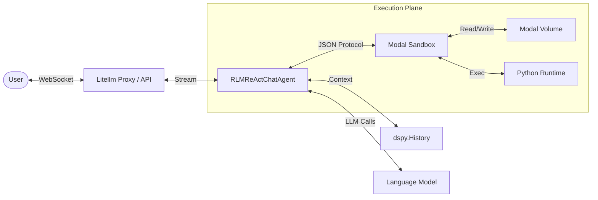
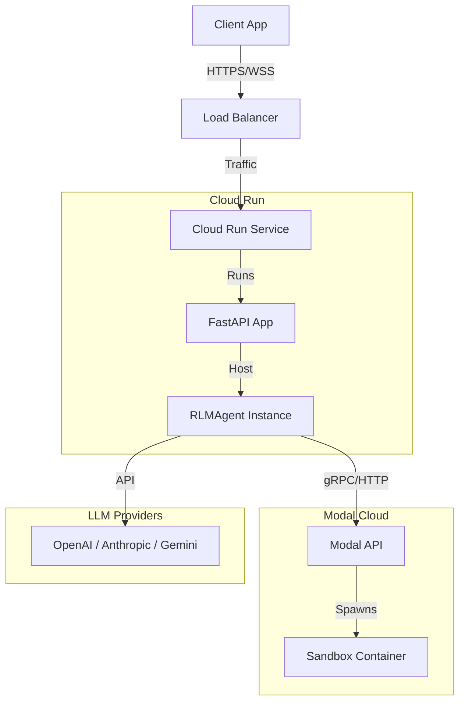
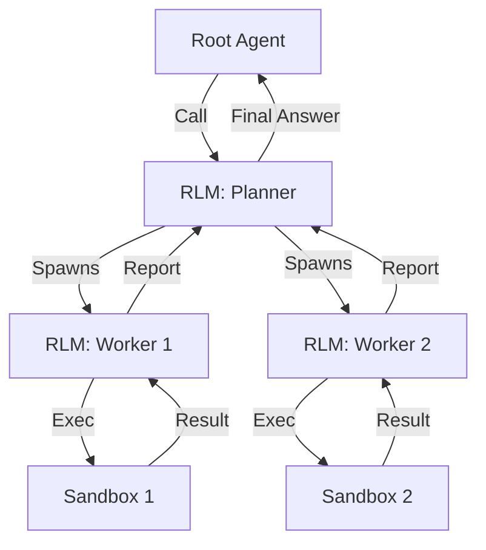

# System Architecture

Visualizing the structural components and relationships within `fleet-rlm`.

## 1. Module Hierarchy

The DSPy module structure of the interactive agent.

```mermaid
graph TD
    Agent[RLMReActChatAgent] -->|wraps| ReAct[dspy.ReAct]
    ReAct -->|uses| Signature[RLMReActChatSignature]
    ReAct -->|calls| Tools[Tool List]

    subgraph "Tools"
        Tools -->|Standard| FS[File System Tools]
        Tools -->|Delegate| RLM[dspy.RLM Wrappers]
        Tools -->|Sandbox| Edit[Edit File / Chunking]
    end

    RLM -->|"uses"| Interpreter[ModalInterpreter]
    Edit -->|uses| Interpreter
```

## 2. Component Architecture

Top-level system components and data flow relative to the user and cloud infrastructure.



## 3. Network Topology

Physical/Network view of the deployment.



## 4. RLM Recursive Structure

How `dspy.RLM` handles complex tasks through recursion.


