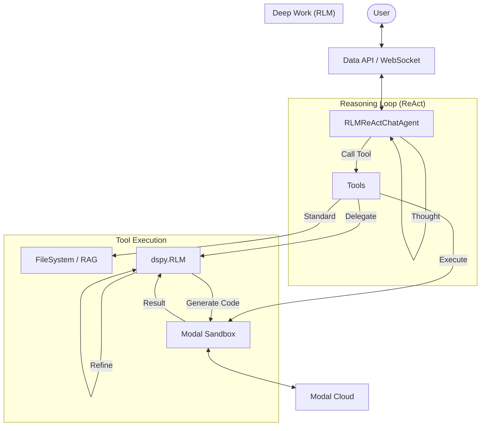

# fleet-rlm Concepts

`fleet-rlm` is a robust agent framework that combines interactive chat with deep, recursive task execution in a secure cloud sandbox.

## Core Architecture

The system is built on four main pillars:

1.  **Interactive Agent (`RLMReActChatAgent`)**
2.  **Recursive Language Model (`dspy.RLM`)**
3.  **Cloud Sandbox (`ModalInterpreter`)**
4.  **Tooling Ecosystem**

---

## 1. Interactive Agent (`RLMReActChatAgent`)

The **Agent** is the user's primary interface. It is a long-running, stateful entity that maintains conversation history and context.

- **Type**: `dspy.Module` (ReAct-based)
- **Role**: Orchestrator. It decides _what_ needs to be done but delegates _how_ to tools.
- **Behavior**: It thinks in a loop: Thought -> Action -> Observation -> Thought.
- **State**: Persists across turns using `dspy.History`.

## 2. Recursive Language Model (`dspy.RLM`)

The **RLM** is the engine for deep, computational work. Unlike the interactive agent, the RLM creates its own programs to solve problems.

- **Type**: `dspy.Module` (RLM)
- **Role**: Specialist. It solves complex, specific tasks by writing and executing code.
- **Behavior**: It generates Python code, runs it in the sandbox, inspects the output, and iterates until the task is complete.
- **Key Feature**: It can recursively spawn sub-RLMs for even finer-grained tasks.

## 3. Cloud Sandbox (`ModalInterpreter`)

The **Sandbox** is the secure execution environment where code runs. It is not running on the user's machine or the main server, but in an isolated cloud container (via Modal).

- **Role**: Execution. It runs Python code, shell commands, and manages files.
- **Features**:
  - **Persistence**: Files and state can persist via Modal Volumes.
  - **Isolation**: Sandbox crashes don't affect the main agent.
  - **Security**: No access to the host environment secrets unless explicitly allowed.
  - **Tools**: It has built-in tools like `llm_query` (to call back to the LLM) and `chunk_text`.

## 4. Tooling Ecosystem

Tools are the bridge between the Agent/RLM and the Sandbox.

- **Host Tools**: Run on the API server (e.g., `load_document`, `list_files`). Used for light work.
- **Sandbox Tools**: Run inside the Modal container (e.g., `execute_code`, `edit_file`). Used for heavy lifting.
- **Delegate Tools**: Trigger RLM workflows (e.g., `analyze_long_document`, `rlm_query`).

---

## Key Workflows

### The "Thinking" Chat

When you ask the agent a question, it doesn't just answer from training data. It checks if it needs more info:

1.  **User**: "Summarize the logs."
2.  **Agent**: "I need to read the logs first." -> Calls `load_document`.
3.  **Agent**: "Now I need to analyze them." -> Calls `extract_from_logs` (RLM).
4.  **RLM**: _Interacts with Sandbox to process logs..._ -> Returns structured data.
5.  **Agent**: "Here is the summary based on the analysis..."

### Recursive Delegation

For complex tasks, the Agent delegates to RLM, which can delegate further:

- **User**: "Refactor the codebase."
- **Agent**: Calls `rlm_query("Refactor codebase")`.
- **RLM (Parent)**: Identifies 5 files to change. Spawns 5 `rlm_query` sub-calls.
- **RLM (Child)**: Edits one file, runs tests, confirms fix.
- **RLM (Parent)**: Collects results, verifies integration.
- **Agent**: Reports success.
