# DSPy Alignment Audit — fleet-rlm v0.4.1

Comprehensive audit of `fleet-rlm`'s usage of DSPy's core abstractions against the canonical API.

---

## 1. Signatures

### DSPy Canonical API

`dspy.Signature` defines I/O schemas for LLM calls. Supports:

- **Class-based** with `InputField` / `OutputField` (recommended for complex tasks)
- **String shorthand** `"input1, input2 -> output1"` (simple tasks)
- `with_instructions()` for runtime instruction injection
- **Pydantic types** for structured output (`list[str]`, `dict[str, str]`, custom models)

### fleet-rlm Usage

| File                                                                                                                                                   | Signatures                                                                                                                                                    | Style               |
| ------------------------------------------------------------------------------------------------------------------------------------------------------ | ------------------------------------------------------------------------------------------------------------------------------------------------------------- | ------------------- |
| [signatures.py](file:///Volumes/Samsung-SSD-T7/Workspaces/Github/qredence/agent-framework/v0.5/_WORLD/_RLM/fleet-rlm-dspy/src/fleet_rlm/signatures.py) | `ExtractArchitecture`, `ExtractAPIEndpoints`, `FindErrorPatterns`, `ExtractWithCustomTool`, `AnalyzeLongDocument`, `SummarizeLongDocument`, `ExtractFromLogs` | Class-based ✅      |
| [agent.py](file:///Volumes/Samsung-SSD-T7/Workspaces/Github/qredence/agent-framework/v0.5/_WORLD/_RLM/fleet-rlm-dspy/src/fleet_rlm/react/agent.py)     | `RLMReActChatSignature`                                                                                                                                       | Class-based ✅      |
| [runners.py](file:///Volumes/Samsung-SSD-T7/Workspaces/Github/qredence/agent-framework/v0.5/_WORLD/_RLM/fleet-rlm-dspy/src/fleet_rlm/runners.py)       | `"question -> answer"`, `"text -> summary"`                                                                                                                   | String shorthand ✅ |

### Alignment Assessment: ✅ Strong

> [!TIP]
> fleet-rlm correctly uses both class-based and string shorthand signatures, with proper `InputField`/`OutputField` annotations and descriptive docstrings.

### Gaps

| Gap                           | Severity | Detail                                                                                                                                         |
| ----------------------------- | -------- | ---------------------------------------------------------------------------------------------------------------------------------------------- |
| **Bare generic types**        | Medium   | Output fields use `list`, `dict`, `int` instead of `list[str]`, `dict[str, str]`. DSPy supports Pydantic-typed output for stronger parsing.    |
| **No `with_instructions()`**  | Low      | No runtime instruction injection. All instructions are static docstrings — fine for current use cases but limits dynamic prompt customization. |
| **No Pydantic output models** | Low      | No signatures use custom Pydantic `BaseModel` output types for deeply structured results.                                                      |

---

## 2. Modules & Programs

### DSPy Canonical API

- `dspy.Module` subclass: define `__init__()` (declare sub-modules) + `forward()` (execution logic)
- Enables **optimization** (via `dspy.BootstrapFewShot`, `dspy.MIPROv2`, etc.)
- Composable: modules can nest other modules, creating hierarchical programs
- `save()` / `load()` for trained state persistence

### fleet-rlm Usage

| Component           | Is `dspy.Module`? | Details                                                                              |
| ------------------- | ----------------- | ------------------------------------------------------------------------------------ |
| `RLMReActChatAgent` | ❌ No             | Standalone class. Wraps `dspy.ReAct` internally but is NOT a `dspy.Module` subclass  |
| `ModalInterpreter`  | ❌ No             | Implements `dspy.CodeInterpreter` protocol (correct — it's not meant to be a Module) |
| Runner functions    | N/A               | Procedural functions that instantiate `dspy.RLM` inline                              |

### Alignment Assessment: ⚠️ Partial

> [!WARNING]
> `RLMReActChatAgent` does not subclass `dspy.Module`. This means it **cannot** participate in DSPy's optimization pipeline (`BootstrapFewShot`, `MIPROv2`, etc.) and lacks `save()`/`load()` for trained state.

### Gaps

| Gap                              | Severity | Detail                                                                                                                                                                                                                                                    |
| -------------------------------- | -------- | --------------------------------------------------------------------------------------------------------------------------------------------------------------------------------------------------------------------------------------------------------- |
| **Agent not a `dspy.Module`**    | **High** | `RLMReActChatAgent` should subclass `dspy.Module` with a `forward()` method so DSPy optimizers can discover and tune its parameters. The internal `dspy.ReAct` instance is already a Module, but the wrapping agent hides it from the optimization graph. |
| **No composed Module hierarchy** | Medium   | Runners instantiate `dspy.RLM` procedurally — no Module that composes `RLM` + post-processing into a reusable, optimizable program.                                                                                                                       |
| **No `save()`/`load()` support** | Medium   | Without `dspy.Module` inheritance, trained prompts/demos can't be persisted.                                                                                                                                                                              |
| **No `dspy.CodeAct` evaluation** | Medium   | `dspy.CodeAct` (see [§5](#5-codeact-vs-react)) combines ReAct reasoning with code execution via interpreter — a natural fit for fleet-rlm's `ModalInterpreter`.                                                                                           |

#### Recommended Fix

```python
class RLMReActChatAgent(dspy.Module):
    def __init__(self, *, react_max_iters=10, ...):
        super().__init__()
        # ... existing init ...
        # Option A: ReAct (current — tool-calling via function signatures)
        self.react = dspy.ReAct(
            signature=RLMReActChatSignature,
            tools=self.react_tools,
            max_iters=react_max_iters,
        )
        # Option B: CodeAct (proposed — code-generation via interpreter)
        # self.react = dspy.CodeAct(
        #     signature=RLMReActChatSignature,
        #     tools=self.react_tools,
        #     max_iters=react_max_iters,
        #     interpreter=self.interpreter,  # ← ModalInterpreter
        # )

    def forward(self, user_request: str, history: dspy.History = None):
        return self.react(user_request=user_request, history=history or self.history)
```

---

## 3. Tools

### DSPy Canonical API

`dspy.Tool` wraps callables with metadata:

- `func`: the callable
- `name`: tool name (inferred from function name)
- `desc`: description (inferred from docstring)
- `args`: JSON Schema of parameters (inferred from type hints)
- `arg_types`: Python types for deserialization
- `arg_desc`: per-parameter descriptions

`dspy.ReAct` accepts `list[Callable]` **or** `list[dspy.Tool]`. Raw callables work but miss explicit metadata control.

### fleet-rlm Usage

Tools are built as **closure functions** in [build_tool_list()](file:///Volumes/Samsung-SSD-T7/Workspaces/Github/qredence/agent-framework/v0.5/_WORLD/_RLM/fleet-rlm-dspy/src/fleet_rlm/react/tools.py):

```python
# Current pattern — closures passed as raw Callable
def load_document(path: str, alias: str = "active") -> dict[str, Any]:
    """Load a document from path for analysis."""
    ...

self.react_tools = build_tool_list(agent, extra_tools)
# Passed directly to dspy.ReAct(tools=list(self.react_tools))
```

### Alignment Assessment: ⚠️ Partial

### Gaps

| Gap                                          | Severity | Detail                                                                                                                                                               |
| -------------------------------------------- | -------- | -------------------------------------------------------------------------------------------------------------------------------------------------------------------- |
| **No `dspy.Tool` wrappers**                  | Medium   | All tools are raw callables. This works for basic inference but loses explicit control over `name`, `desc`, and `args` visible to the LLM's function-calling schema. |
| **Closure tools have limited introspection** | Low      | Closures may lose `__doc__` or accurate `__name__`. DSPy infers tool metadata from these; `dspy.Tool` gives explicit control.                                        |

#### Recommended Fix

```python
from dspy import Tool

def build_tool_list(agent, extra_tools):
    def load_document(path: str, alias: str = "active") -> dict:
        """Load a document from the local filesystem for analysis."""
        ...

    tools = [
        Tool(load_document, name="load_document",
             desc="Load a document from path for RLM analysis"),
        Tool(chunk_host, name="chunk_host",
             desc="Split document into chunks on the host side"),
        # ...
    ]
    return tools
```

---

## 4. ReAct

### DSPy Canonical API

```python
dspy.ReAct(
    signature: type[Signature],  # Defines I/O schema
    tools: list[Callable],       # Tools the agent can call
    max_iters: int = 20,         # Max reasoning iterations
)
```

- Extends `dspy.Module` — has `forward()` and `acall()` for async
- Signature polymorphism: works with any Signature, not just QA
- Trajectory accessible via `prediction.trajectory`
- Supports `dspy.History` for multi-turn conversation

### fleet-rlm Usage

```python
# agent.py line 484-490
def _build_agent(self) -> dspy.ReAct:
    self.react_tools = build_tool_list(self, self._extra_tools)
    return dspy.ReAct(
        signature=RLMReActChatSignature,  # ✅ Class-based Signature
        tools=list(self.react_tools),      # ✅ List of callables
        max_iters=self.react_max_iters,    # ✅ Configurable
    )
```

### Alignment Assessment: ✅ Strong

> [!NOTE]
> Excellent usage: class-based Signature with `dspy.History`, proper async support via `acall()`, trajectory extraction, configurable `max_iters`, dynamic tool registration via `register_extra_tool()`.

### Minor Gaps

| Gap                                   | Severity | Detail                                                                                                  |
| ------------------------------------- | -------- | ------------------------------------------------------------------------------------------------------- |
| **Trajectory not deeply surfaced**    | Low      | `prediction.trajectory` is passed through but not parsed into structured step objects for debugging UI. |
| **No `dspy.Suggest` / `dspy.Assert`** | Low      | No guardrail assertions in the ReAct loop. DSPy supports inline assertions for quality control.         |

---

## 5. CodeAct vs ReAct

### DSPy Canonical APIs

|                       | [dspy.ReAct](https://dspy.ai/api/modules/ReAct/) | [dspy.CodeAct](https://dspy.ai/api/modules/CodeAct/)         |
| --------------------- | ------------------------------------------------ | ------------------------------------------------------------ |
| **Bases**             | `dspy.Module`                                    | `dspy.ReAct`, `dspy.ProgramOfThought`                        |
| **Tool invocation**   | LLM emits tool-call JSON, DSPy executes tool     | LLM generates Python code calling tools, runs in interpreter |
| **Interpreter**       | None (tools called directly)                     | `PythonInterpreter` (Deno/Pyodide sandbox)                   |
| **Tool types**        | Functions, callables, `dspy.Tool`                | **Pure functions only** (no callable objects)                |
| **External libs**     | N/A (tools are host-side)                        | ❌ Not allowed in generated code                             |
| **Default max_iters** | 20                                               | 5                                                            |
| **Signature**         | `str \| type[Signature]`                         | `str \| type[Signature]`                                     |

### Key Insight for fleet-rlm

> [!IMPORTANT]
> `dspy.CodeAct` is architecturally closer to what fleet-rlm already does than `dspy.ReAct`. CodeAct generates code that calls tools inside a sandbox — which is exactly what `ModalInterpreter` + `dspy.RLM` does. The difference is that CodeAct's built-in `PythonInterpreter` uses a local Deno/Pyodide sandbox, while fleet-rlm uses a **cloud Modal sandbox**.

### Alignment Assessment: 🔍 Investigation Recommended

| Consideration             | ReAct (current)                                      | CodeAct (alternative)                                                  |
| ------------------------- | ---------------------------------------------------- | ---------------------------------------------------------------------- |
| Tool-calling model        | LLM decides which tool to call via structured output | LLM writes Python code invoking tools — more flexible                  |
| Code execution            | Separate `dspy.RLM` pathway                          | Built-in via interpreter param                                         |
| `ModalInterpreter` compat | Not used by ReAct                                    | Could be passed as `interpreter=` if it implements `PythonInterpreter` |
| Callable objects as tools | ✅ Supported                                         | ❌ Only pure functions                                                 |
| External library access   | N/A                                                  | ❌ Blocked (but `ModalInterpreter` already handles this in sandbox)    |

### Recommendation

fleet-rlm should evaluate a **dual-module strategy**:

1. **Keep `dspy.ReAct`** for the interactive chat agent (tool-calling pattern, supports callable objects)
2. **Adopt `dspy.CodeAct`** for RLM-style workflows where code generation + sandbox execution is the primary pattern
3. The `ModalInterpreter` may need to implement `PythonInterpreter` protocol (not just `CodeInterpreter`) to be directly compatible with CodeAct

```python
# Proposed dual-module approach
class RLMReActChatAgent(dspy.Module):
    def __init__(self, *, mode="react", interpreter=None, ...):
        super().__init__()
        if mode == "codeact" and interpreter:
            self.agent = dspy.CodeAct(
                signature=RLMReActChatSignature,
                tools=self.react_tools,
                interpreter=interpreter,
                max_iters=react_max_iters,
            )
        else:
            self.agent = dspy.ReAct(
                signature=RLMReActChatSignature,
                tools=self.react_tools,
                max_iters=react_max_iters,
            )
```

---

## 6. RLM & CodeInterpreter

### DSPy Canonical API

```python
dspy.RLM(
    signature,             # I/O schema
    interpreter,           # dspy.CodeInterpreter implementation
    max_iterations=20,     # Max code-execution loops
    max_llm_calls=None,    # LLM call budget
    sub_lm=None,           # Sub-LM for llm_query/llm_query_batched
    tools=None,            # Additional callable tools
    verbose=False,
)
```

`dspy.CodeInterpreter` protocol:

- `execute(code: str) -> str` — runs code, returns output
- `tools` property — dict of callable tools available in sandbox
- Optional: `shutdown()`, context manager

### fleet-rlm Usage

**`ModalInterpreter`** — full `CodeInterpreter` implementation:

| Feature              | Status | Detail                                                                               |
| -------------------- | ------ | ------------------------------------------------------------------------------------ |
| `execute(code)`      | ✅     | JSON protocol to Modal sandbox via `sandbox_driver`                                  |
| `tools` property     | ✅     | Returns `llm_query`, `llm_query_batched`, `peek`, `grep`, `chunk_by_*`, custom tools |
| `shutdown()`         | ✅     | Terminates sandbox                                                                   |
| Context manager      | ✅     | `__enter__`/`__exit__` for lifecycle                                                 |
| `start()` idempotent | ✅     | Safe to call multiple times                                                          |
| Sub-LM support       | ✅     | Configurable `sub_lm` parameter                                                      |

**Runners** — proper `dspy.RLM` instantiation:

```python
# runners.py line 297-303 — basic runner
rlm = dspy.RLM(
    signature="question -> answer",
    interpreter=interpreter,
    max_iterations=max_iterations,
    max_llm_calls=max_llm_calls,
    verbose=verbose,
)

# runners.py line 620-627 — custom tool runner
rlm = dspy.RLM(
    signature=ExtractWithCustomTool,
    interpreter=interpreter,
    tools=[regex_extract],  # ✅ Custom tool passed to RLM
    max_iterations=max_iterations,
    max_llm_calls=max_llm_calls,
    verbose=verbose,
)
```

### Alignment Assessment: ✅ Excellent

> [!NOTE]
> `ModalInterpreter` is the most complete `CodeInterpreter` implementation found outside of DSPy's own `PythonInterpreter`. It exceeds the protocol with stdout summarization, sensitive data redaction, volume persistence, execution profiles, and document chunking helpers.

### Minor Gaps

| Gap                               | Severity | Detail                                                                                                              |
| --------------------------------- | -------- | ------------------------------------------------------------------------------------------------------------------- |
| **No `aexecute()` async**         | Medium   | `execute()` is synchronous. DSPy's `RLM.aforward()` exists but requires async interpreter support for full benefit. |
| **No `max_output_chars`**         | Low      | DSPy RLM supports truncating sandbox output; `ModalInterpreter` uses summarization instead (arguably better).       |
| **No `PythonInterpreter` compat** | Medium   | `ModalInterpreter` implements `CodeInterpreter` but not `PythonInterpreter`, which `CodeAct` requires.              |

---

## 7. Additional DSPy Primitives

| Primitive                      | DSPy Canonical         | fleet-rlm Usage                                    | Assessment                                |
| ------------------------------ | ---------------------- | -------------------------------------------------- | ----------------------------------------- |
| `dspy.History`                 | Multi-turn memory      | ✅ Used in `RLMReActChatSignature` with LRU bounds | **Strong**                                |
| `dspy.Predict`                 | Basic LLM call module  | ❌ Not used directly                               | Low gap — `ReAct` handles this internally |
| `dspy.ChainOfThought`          | Step-by-step reasoning | ❌ Not used                                        | Low gap — `ReAct` provides reasoning      |
| `dspy.ProgramOfThought`        | Code-gen reasoning     | ❌ Not used (CodeAct inherits this)                | Medium gap — relevant for RLM workflows   |
| `dspy.Suggest` / `dspy.Assert` | Runtime guardrails     | ❌ Not used                                        | Medium gap — would improve reliability    |
| `dspy.context()`               | Async-safe LM config   | ✅ Used in `arun_react_chat_once`                  | **Aligned**                               |
| `dspy.configure()`             | Global LM config       | ✅ Used in `configure_planner_from_env`            | **Aligned**                               |
| `dspy.settings.lm`             | Active LM check        | ✅ Used for readiness check                        | **Aligned**                               |

---

## Summary: Alignment Scorecard

| DSPy Abstraction          | Alignment    | Priority Gaps                                          |
| ------------------------- | ------------ | ------------------------------------------------------ |
| **Signature**             | ✅ Strong    | Bare generic types → use typed generics                |
| **Module / Program**      | ⚠️ Partial   | **Agent not a `dspy.Module`** (blocks optimization)    |
| **Tool**                  | ⚠️ Partial   | Raw callables → wrap with `dspy.Tool`                  |
| **ReAct**                 | ✅ Strong    | Minor: add `dspy.Suggest`/`Assert`                     |
| **CodeAct**               | 🔍 Evaluate  | **Natural fit** for RLM workflows; needs investigation |
| **RLM / CodeInterpreter** | ✅ Excellent | Minor: async execute, `PythonInterpreter` compat       |
| **History / Context**     | ✅ Strong    | No gaps                                                |

---

## Prioritized Recommendations

| #   | Recommendation                                     | Priority | Impact                                                                       | Effort |
| --- | -------------------------------------------------- | -------- | ---------------------------------------------------------------------------- | ------ |
| 1   | Make `RLMReActChatAgent` a `dspy.Module` subclass  | **P0**   | Unlocks DSPy optimization (`BootstrapFewShot`, `MIPROv2`, `save()`/`load()`) | Medium |
| 2   | Evaluate `dspy.CodeAct` for RLM-style workflows    | **P0**   | Unifies ReAct + code-execution; natural fit for `ModalInterpreter`           | Medium |
| 3   | Wrap tools with `dspy.Tool`                        | **P1**   | Explicit tool metadata control for LLM function-calling                      | Low    |
| 4   | Add typed generics to Signature output fields      | **P1**   | Stronger output parsing: `list[str]` vs bare `list`                          | Low    |
| 5   | Add `dspy.Suggest`/`Assert` guardrails             | **P2**   | Runtime quality control in ReAct loops                                       | Low    |
| 6   | Create composed `dspy.Module` for runner workflows | **P2**   | Reusable, optimizable extraction programs                                    | Medium |
| 7   | Implement async `execute()` in `ModalInterpreter`  | **P2**   | Full async pipeline support for `RLM.aforward()`                             | Medium |
| 8   | Implement `PythonInterpreter` compat for `CodeAct` | **P2**   | Required for `CodeAct` to use `ModalInterpreter` directly                    | Medium |
| 9   | Use `with_instructions()` for dynamic prompts      | **P3**   | Runtime prompt customization without new Signature classes                   | Low    |

---

## Architecture Diagram — Current vs. Proposed

```mermaid
graph TD
    subgraph "Current Architecture"
        A["RLMReActChatAgent (plain class)"]
        B["dspy.ReAct (Module)"]
        C["dspy.RLM (Module)"]
        D["ModalInterpreter (CodeInterpreter)"]
        A -->|"wraps"| B
        B -->|"hidden from optimizer"| C
        C -->|"uses"| D
    end

    subgraph "Proposed Architecture"
        E["RLMReActChatAgent (dspy.Module)"]
        F["dspy.ReAct or dspy.CodeAct"]
        G["dspy.RLM (Module)"]
        H["ModalInterpreter (Code+PythonInterpreter)"]
        I["dspy.Tool wrappers"]
        J["DSPy Optimizer"]
        K["Recursive sub-agents"]
        E -->|"forward()"| F
        F -->|"tools"| I
        F -->|"delegates"| G
        G -->|"uses"| H
        G -->|"spawns"| K
        K -->|"child RLM"| H
        J -->|"optimizes"| E
    end
```


